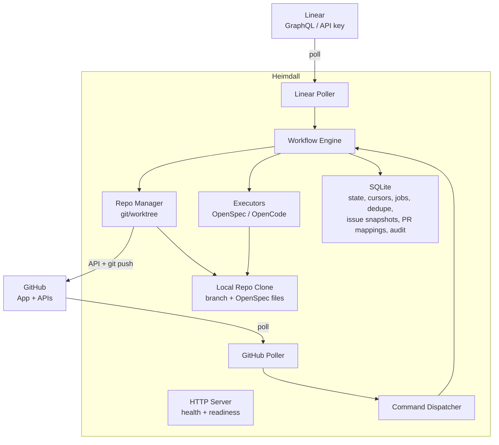
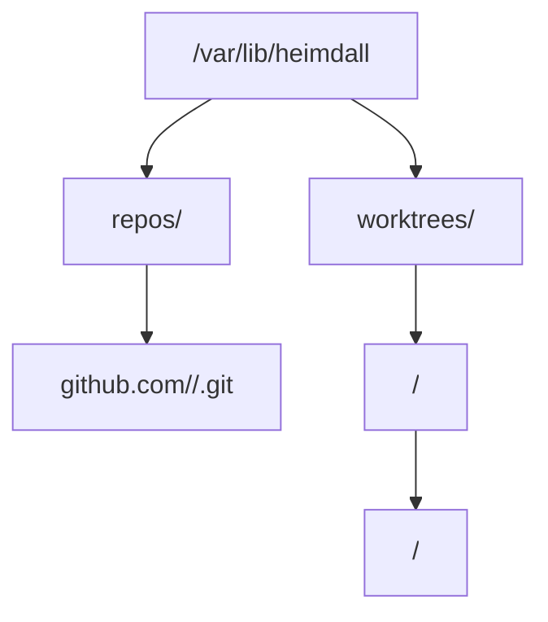
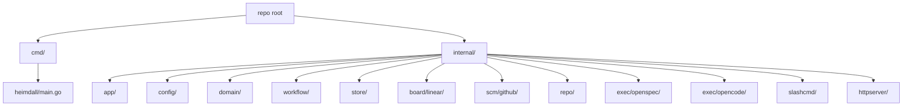

# System Architecture

## Runtime Overview

Heimdall should be a single Go binary with three long-running responsibilities:

- a background poller that watches Linear for state transitions
- a background poller that watches GitHub for new PR comments and relevant PR state changes
- an HTTP server for health, readiness, and any private operator endpoints

The two pollers feed a shared workflow engine backed by a persistent store, while the HTTP server exposes health, readiness, and private operator endpoints.



## Workflow Engine

The workflow engine owns business state and orchestration. It should be the only component that decides whether an action is new, duplicate, retryable, or blocked.

Responsibilities:

- create and resume workflow runs
- enforce idempotency
- reconcile existing branches and PRs before creating new ones
- sequence propose, refine, apply, and archive actions
- emit audit events and user-facing status comments

## Board Provider Adapter

V1 has one board provider: Linear.

The adapter should hide Linear-specific details behind a normalized model:

- `WorkItem`
- `WorkItemEvent`
- `ProviderCursor`

The rest of the system should not depend on Linear field names or GraphQL query details.

## GitHub Integration

GitHub responsibilities should be split internally even though they target the same external system:

- GitHub App auth and installation token minting
- repo operations such as branch, commit, push, and PR creation
- polling for issue comments and pull request state changes
- normalization of polled GitHub activity into command and reconciliation inputs
- PR comment publishing and status feedback

Keeping these concerns separate makes testing easier and reduces the blast radius of auth bugs.

## Repo Manager

Heimdall needs a reliable local checkout strategy because OpenSpec and OpenCode run locally.

Recommended strategy:

- maintain a bare mirror for each configured repository
- create a worktree per active workflow run
- push back to GitHub using installation tokens over HTTPS

Suggested layout:



This gives three benefits:

- branch work happens in isolated directories
- repeated runs do not require a full clone every time
- recovery and cleanup are straightforward

## OpenSpec And OpenCode Execution

V1 should wrap the local CLIs rather than embedding provider-specific logic directly into the workflow engine.

Two small adapters are enough:

- `OpenSpecClient` for change creation, status inspection, instructions, and archive actions
- `OpenCodeClient` for agent-driven proposal generation, refinement, and apply operations

Important rule: Heimdall should trust CLI JSON output for workflow state instead of inferring artifact layout on its own.

## Persistence Model

Use SQLite in V1 because the target deployment is a single Linux host and operator simplicity matters.

The database should store at least:

- provider cursors for Linear polling
- provider cursors or checkpoints for GitHub polling
- last seen issue state snapshots
- workflow runs and phase status
- repo and PR bindings
- comment command dedupe keys
- audit trail records

SQLite is enough for one service instance. If Heimdall later becomes multi-node or multi-tenant, the storage layer can move to Postgres behind the same store interface.

## Concurrency Model

Concurrency should be limited and explicit.

- one active workflow lock per issue
- one repo-scoped mutation lock for branch-changing operations
- asynchronous job workers for long-running tasks
- fast polling cycles that enqueue work instead of doing repo mutation inline

This prevents duplicate branches, conflicting pushes, and long poll cycles from turning into unsafe concurrent mutations.

## Go Package Layout

The initial project structure should stay small and idiomatic:



Notes:

- keep `main.go` thin
- define small interfaces where they are consumed, not in a global `interfaces` package
- return concrete types from constructors
- pass `context.Context` through every external call path

## Core Internal Models

The domain model should stay provider-neutral where possible.

```go
type WorkItem struct {
	Provider      string
	ID            string
	Key           string
	Title         string
	Description   string
	State         string
	Project       string
	Team          string
	Labels        []string
	RepositoryRef string
}

type WorkItemEvent struct {
	Provider   string
	EventID    string
	WorkItemID string
	Type       string
	OccurredAt time.Time
}

type WorkflowAction string

const (
	ActionPropose WorkflowAction = "propose"
	ActionRefine  WorkflowAction = "refine"
	ActionApply   WorkflowAction = "apply"
	ActionArchive WorkflowAction = "archive"
)
```

## Interface Boundaries

The most important boundaries should stay narrow:

```go
type BoardProvider interface {
	PollTransitions(ctx context.Context, cursor string) ([]WorkItemEvent, string, error)
	GetWorkItem(ctx context.Context, id string) (WorkItem, error)
}

type SpecExecutor interface {
	Propose(ctx context.Context, repoPath string, item WorkItem) error
	Refine(ctx context.Context, repoPath string, req RefineRequest) error
	Apply(ctx context.Context, repoPath string, req ApplyRequest) error
}
```

These interfaces are intentionally small so Linear, Jira, local CLI execution, and future remote execution can be swapped with minimal churn.
