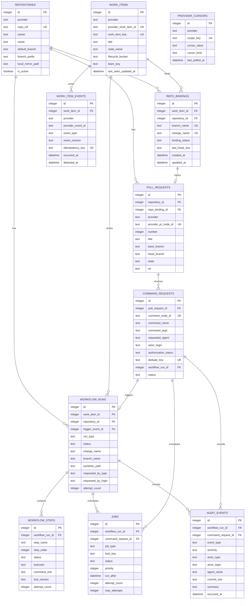

# SQLite Schema

## Design Intent

The database should capture durable workflow state, not become a second configuration system.

Configuration belongs in the project-root `.env` file or equivalent environment variables, and multiline secrets should be referenced through external secret files where practical.

SQLite stores:

- poll cursors
- latest work-item snapshots
- normalized transition events
- workflow runs and steps
- repo bindings and pull requests
- slash-command requests
- async jobs and audit events

## Mermaid ERD

## Table Roles

### `provider_cursors`

Stores the current polling position for each provider scope, such as a configured Linear project or a GitHub repository poll scope.

### `repositories`

Stores the repositories Heimdall manages and the local bare-mirror paths it uses for worktree creation.

### `work_items`

Stores the latest normalized snapshot of each tracked board item.

This is the current state table, not the full event history.

### `work_item_events`

Stores normalized transition events such as `entered_active_state` and provides the main idempotency boundary for polling.

### `repo_bindings`

Represents the durable one-issue-to-one-repo automation binding.

This is the record that ties together the work item, branch name, change name, and current lifecycle status.

### `pull_requests`

Stores GitHub PR identity and state so Heimdall can reconcile polled comment activity and PR lifecycle changes.

### `command_requests`

Stores PR comment commands, their dedupe keys, authorization results, selected agent, and downstream workflow linkage.

### `workflow_runs`

Stores top-level runs for `propose`, `refine`, `apply`, `archive`, and reconciliation work.

### `workflow_steps`

Stores step-level execution details inside a workflow run, including which executor ran, which command line was used, and how many attempts occurred.

### `jobs`

Stores queued async work with retry scheduling and lock keys.

Recommended lock-key shapes:

- `issue:<provider>:<work-item-key>`
- `repo:<repo-ref>`

### `audit_events`

Stores append-only audit records that answer who requested a change, which agent ran, which commit was created, and whether the action succeeded.

## Important Constraints

- `work_item_events.idempotency_key` must be unique
- `command_requests.dedupe_key` must be unique
- `command_requests.comment_node_id` must be unique
- `repo_bindings(work_item_id, repository_id)` should be unique
- `pull_requests(repository_id, number)` should be unique

## What Does Not Belong In SQLite

- GitHub App private keys
- installation tokens
- Linear API keys
- static repo routing rules
- allowed GitHub users and agents

Those belong in the service configuration and secret store.
