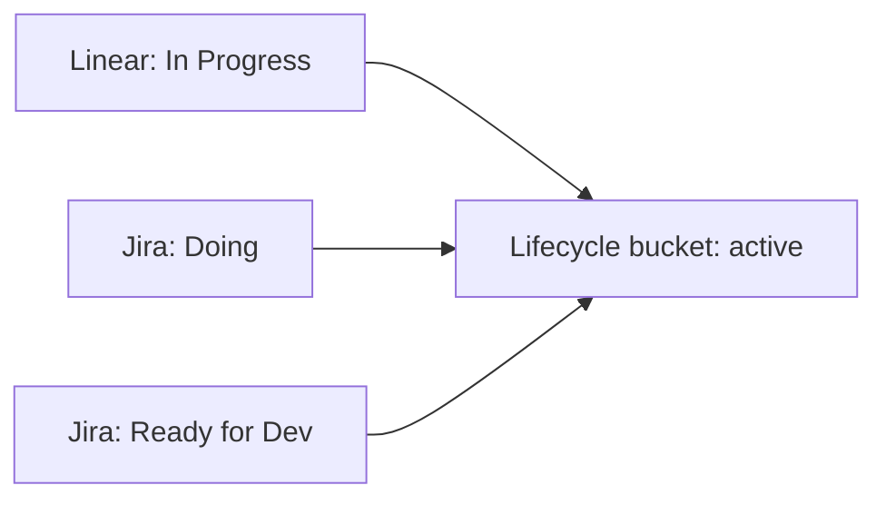

# Extensibility Strategy

## Why Extensibility Matters In V1

You explicitly want the design to leave room for Jira and other kanban boards later.

That means V1 should not model the world as "Linear plus some helpers." It should model the world as:

- a board provider that emits normalized work item transitions
- an SCM provider that owns repositories, branches, PRs, and comments
- an execution provider that performs OpenSpec and OpenCode actions

Linear and GitHub are just the first concrete adapters.

## Stable Core Models

The core should standardize on these neutral concepts:

- `WorkItem`
- `WorkItemEvent`
- `RepositoryBinding`
- `WorkflowRun`
- `CommandRequest`
- `ExecutionResult`

Examples of provider-specific details that should stay out of the core:

- Linear state IDs
- Jira transition IDs
- GitHub installation payload shapes
- provider-specific event payloads, polling cursors, or webhook headers

## Recommended Adapter Seams

### Board Provider

Responsibilities:

- list or poll relevant state transitions
- fetch full work item details
- normalize provider states into lifecycle buckets such as `active`

First implementations:

- `linear.Provider`
- later `jira.Provider`

### SCM Provider

Responsibilities:

- create or discover branches
- push commits
- create or update pull requests
- read and publish PR comments
- discover relevant PR activity through provider APIs or event delivery

First implementation:

- `github.Provider`

### Execution Provider

Responsibilities:

- create and inspect OpenSpec changes
- refine artifacts
- apply tasks with a selected agent
- archive changes

First implementation:

- `localcli.Executor`

Later implementations could include:

- a remote execution service
- a thin wrapper around a stable OpenCode SDK

## Why A Local CLI Executor Is Still Extensible

Your chosen V1 model is local CLI execution on the Linux host.

That is the right tradeoff for simplicity, but the design should acknowledge a future risk: CLI surfaces can change.

To contain that risk:

- isolate CLI calls in one package
- prefer JSON output over parsing human text
- keep prompt construction and command construction versioned
- record the exact CLI command and version used for each workflow run

## Jira Readiness

The main thing that makes Jira support hard is not authentication. It is workflow shape.

Jira teams often have:

- more custom states
- project-specific workflows
- more complex field mappings
- more than one path into an "active" state

The design should therefore make active-state mapping configurable:

Example:

- Linear `In Progress` -> `active`
- Jira `Doing` -> `active`
- Jira `Ready for Dev` -> `active`

This keeps the workflow engine stable while adapters own provider semantics.

## Suggested Expansion Order

If Symphony grows beyond the first release, the safest order is:

1. multiple repositories with richer routing rules
2. remote execution abstraction for OpenCode operations
3. Postgres storage option
4. Jira board adapter
5. optional web UI for operators

This order expands reach without destabilizing the core issue-to-PR workflow too early.

## What Should Not Change Later

Even as providers change, these product expectations should stay stable:

- moving a work item into an active state starts a workflow
- a deterministic branch and PR are created or reconciled
- the spec is reviewable before implementation
- refinement and apply actions happen from PR comments
- every mutation is attributable to a user request and a commit
