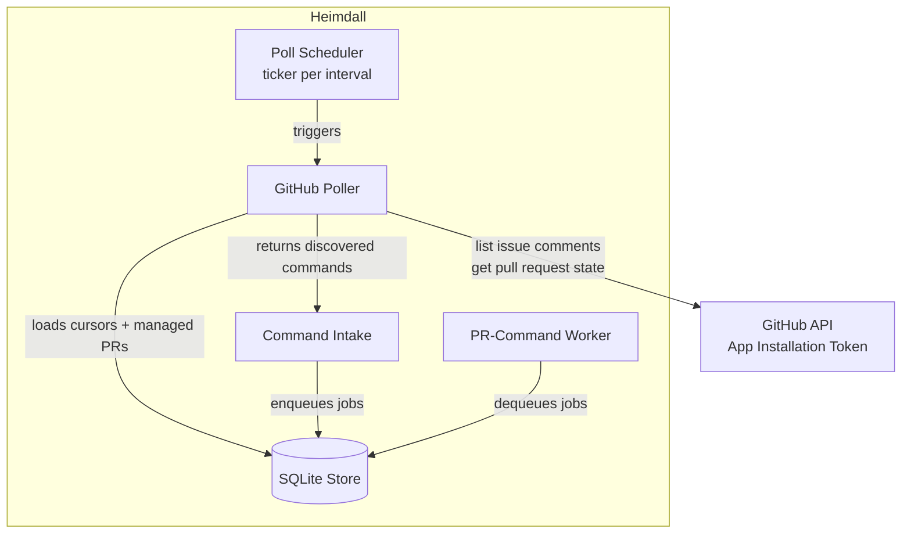
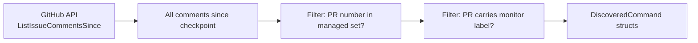

# GitHub Polling And Multi-PR Discovery

Heimdall discovers PR comments and state changes through polling, not webhooks. This document describes how the GitHub poller operates across multiple repositories and pull requests in a single cycle.

## Why Polling?

V1 avoids requiring a public inbound webhook endpoint. Polling keeps the deployment simple:

- One Linux host
- Outbound HTTPS only
- No NAT, tunnel, or ingress configuration

The tradeoff is that Heimdall must actively ask GitHub what changed rather than being told.

## Polling Architecture



## Poll Cycle

### 1. Enumerate Active Repositories

The poller starts by loading every repository Heimdall manages:

```go
repositories, err := store.ListActiveRepositories(ctx)
```

Each repository is polled independently. A failure in one repository does not stop polling for the others, but the current implementation returns early on error; in practice operators should size lookback windows to avoid transient failures aborting the whole cycle.

### 2. Per-Repository Checkpoint

For each repository, the poller computes a `since` timestamp:

```
since = max(last_checkpoint, now - lookback_window)
```

The `lookback_window` (default `2m`) ensures that comments created just before the last checkpoint are not missed if the previous cycle was delayed or failed.

Checkpoints are stored in `provider_cursors` scoped by `repo_ref`.

### 3. Reconcile Managed Pull Requests

Before looking for new comments, the poller refreshes the state of every Heimdall-managed PR in the repository:

1. Load managed PRs from SQLite (`ListManagedPullRequests`)
2. Call GitHub API `GetPullRequest` for each
3. If a `PRMonitorLabel` is configured, skip PRs that do not currently carry that label
4. Update SQLite with the latest PR state (title, base/head branch, state, URL)
5. Record PRs whose state changed in the `Reconciled` list

This reconciliation ensures the worker always operates on fresh PR metadata even if the poller missed a state change event.

### 4. Discover New Comments

If at least one eligible managed PR exists, the poller fetches all issue comments since `since`:

```go
comments, err := api.ListIssueCommentsSince(ctx, owner, repo, since)
```

This is a single batched API call per repository, not one call per PR. Heimdall then filters the comment list:

1. Parse the issue URL from each comment to extract the PR number
2. Keep only comments whose PR number matches an eligible managed PR
3. Discard comments on non-Heimdall PRs



### 5. Advance Checkpoint

After processing all comments, the poller saves the current time as the new checkpoint:

```go
store.SetGitHubPollCheckpoint(ctx, repoRef, checkpointTime)
```

The checkpoint is advanced regardless of whether comments were found, so the next cycle starts from a clean boundary.

## Handling Multiple Repositories And PRs

### Multi-Repository

The poller iterates every active repository sequentially. The result is aggregated:

```go
type PollResult struct {
    Commands    []DiscoveredCommand
    Reconciled  []PullRequest
    Checkpoints map[string]time.Time
}
```

Each repository gets its own checkpoint, so a delayed or failed cycle for `repo-a` does not cause `repo-b` to reprocess old comments.

### Multi-PR Per Repository

Within one repository:

- All managed PRs are reconciled (state refresh)
- A single `ListIssueCommentsSince` call fetches comments for the whole repo
- Comments are mapped back to PRs by parsing the `issue_url` field

This is more efficient than N API calls for N PRs.

## PR Monitor Labels

When `HEIMDALL_REPO_<ID>_PR_MONITOR_LABEL` is set:

- Heimdall creates the label in the repository if it does not exist
- The label is applied to every Heimdall-created PR
- Polling only considers comments on PRs that currently carry the label
- If a label is removed from a PR manually, Heimdall stops monitoring it until the label is restored

This lets operators narrow Heimdall's attention to a subset of PRs without reconfiguring the service.

## Deduplication

Comment deduplication happens in the **intake layer**, not the poller. The poller's job is to discover; the intake layer decides whether to act.

The intake layer uses:

```
dedupe_key = "github-comment:" + comment.NodeID
```

If a `CommandRequest` with that key already exists, the observation is marked duplicate and no job is enqueued.

## Error Handling

| Failure Mode | Behavior |
|-------------|----------|
| GitHub API rate limit | Poll cycle fails; checkpoint is **not** advanced; retry on next tick |
| Network timeout | Same as rate limit |
| Repository has no managed PRs | Checkpoint is still advanced; no error |
| Single PR reconciliation fails | Current implementation fails the whole repository cycle |
| Comment parsing fails | Comment is skipped; cycle continues |

## Configuration

| Setting | Default | Description |
|---------|---------|-------------|
| `HEIMDALL_GITHUB_POLL_INTERVAL` | `30s` | How often to run a poll cycle |
| `HEIMDALL_GITHUB_LOOKBACK_WINDOW` | `2m` | How far back to look relative to the last checkpoint |
| `HEIMDALL_REPO_<ID>_PR_MONITOR_LABEL` | (none) | Optional label to narrow polling scope |

## Related Documentation

- `docs/runtime-state.md` — State machines for discovered commands and jobs
- `docs/worker-execution.md` — How discovered commands become executed jobs
- `docs/architecture.md` — Overall runtime architecture
- `docs/authentication.md` — GitHub App authentication for API calls
