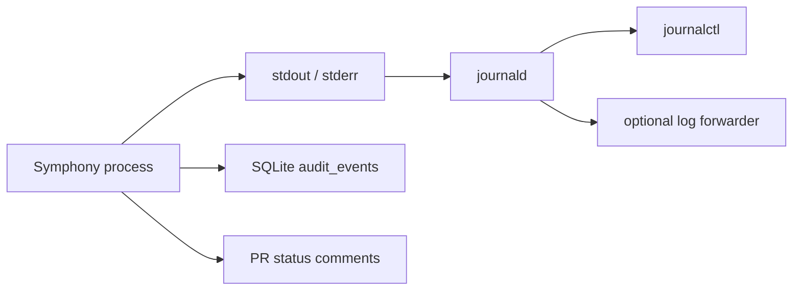

# Logging And Log Access

## Logging Goals

Symphony should make it easy to answer four questions:

- did Symphony see the event or command?
- what workflow run was created?
- what step failed or retried?
- which commit, PR, issue, and agent were involved?

## Recommended Logging Model

The application should emit structured logs to stdout and stderr.

The Linux service manager should collect those logs, and in v1 the default collector should be `systemd` with `journald`.

This keeps the application simple:

- Symphony does not need to manage its own log rotation
- logs are easy to follow live with `journalctl`
- future forwarding to a central log system can happen outside the app

## Logging Flow



Operational logs, audit records, and PR comments serve different purposes:

- operational logs explain what the process did at runtime
- `audit_events` give durable workflow history inside SQLite
- PR comments tell the operator what happened without opening the server

## Recommended Log Format

Use JSON logs by default.

Every log line should include these common fields when available:

- `ts`
- `level`
- `service`
- `workflow_id`
- `run_type`
- `step`
- `issue_key`
- `repo`
- `pr_number`
- `comment_id`
- `agent`
- `attempt`
- `duration_ms`
- `error_code`
- `message`

Example:

```json
{
  "ts": "2026-04-04T12:30:55Z",
  "level": "info",
  "service": "symphony",
  "workflow_id": "wf_018f",
  "run_type": "apply",
  "step": "push_branch",
  "issue_key": "ENG-123",
  "repo": "github.com/acme/platform",
  "pr_number": 42,
  "agent": "gpt-5.4",
  "attempt": 1,
  "message": "pushed branch after apply run"
}
```

## Log Levels

- `debug`: local troubleshooting and verbose executor details
- `info`: normal workflow progress and successful state changes
- `warn`: retries, degraded behavior, or unexpected but recoverable conditions
- `error`: failed workflow steps, authorization failures, CLI failures, or external API failures

V1 should default to `info`.

## Sensitive Data Rules

Symphony logs must never contain:

- GitHub App private keys
- installation tokens
- Linear API keys
- full unredacted API payload bodies

If a failure must reference a secret-backed path, log the file path only, not the secret content.

## How To View Logs

If Symphony runs under `systemd`, the main operator commands should be:

Follow logs live:

```bash
journalctl -u symphony -f
```

Show recent logs:

```bash
journalctl -u symphony --since "1 hour ago"
```

Show logs for today:

```bash
journalctl -u symphony --since today
```

Show JSON-formatted journal entries:

```bash
journalctl -u symphony -o json-pretty
```

## Finding A Specific Workflow

When troubleshooting a specific run, search by one of these fields:

- `workflow_id`
- `issue_key`
- `pr_number`
- `comment_id`

Examples:

```bash
journalctl -u symphony --since today | rg '"workflow_id":"wf_018f"'
journalctl -u symphony --since today | rg '"issue_key":"ENG-123"'
```

## File Logs

The preferred v1 model is journald-first logging.

If your environment also forwards logs into `/var/log/symphony/`, treat those files as downstream copies managed by the host, not by Symphony itself.

## Recommended Retention Model

- short-term live investigation through `journalctl`
- medium-term retention through journald settings or host-level forwarding
- durable change history through SQLite `audit_events`

The application should not implement its own custom retention policy beyond structured emission.

## What To Look At During An Incident

1. `journalctl -u symphony -f` for current failures
2. PR comments for the user-visible outcome
3. SQLite `audit_events` and `workflow_runs` for durable history
4. repo mirror and worktree state under `/var/lib/symphony/` if git operations failed
