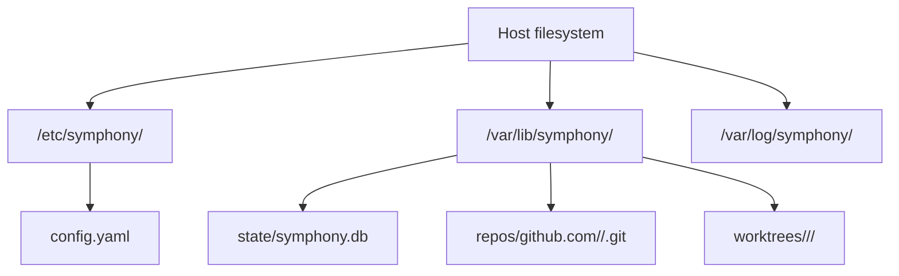

# Operations And Deployment

## Deployment Model

V1 should target one Linux host running one Symphony process.

Recommended shape:

- systemd-managed binary
- local SQLite database file
- local repo mirrors and worktrees
- inbound HTTPS for GitHub webhooks
- outbound HTTPS to GitHub and Linear APIs

## Host Prerequisites

The Linux machine should have:

- `git`
- `openspec`
- `opencode`
- CA certificates for outbound HTTPS
- a writable service data directory

See `setup/linux-host.md` for the full dependency list and host preparation checklist.

If `opencode` requires its own credentials or local runtime setup, that should be treated as a host prerequisite rather than embedded in Symphony itself.

## Recommended Filesystem Layout



## Configuration Shape

V1 should prefer one human-readable config file and environment-backed secrets.

Example:

```yaml
server:
  listen_address: ":8080"
  public_url: "https://symphony.example.com"

storage:
  driver: sqlite
  dsn: "/var/lib/symphony/state/symphony.db"

linear:
  poll_interval: 30s
  active_states:
    - "In Progress"
  team_keys:
    - "ENG"

github:
  webhook_path: "/webhooks/github"
  base_branch: "main"

repos:
  - name: "github.com/acme/platform"
    local_mirror_path: "/var/lib/symphony/repos/github.com/acme/platform.git"
    default_branch: "main"
    branch_prefix: "symphony"
    linear_team_keys:
      - "ENG"
    allowed_agents:
      - "gpt-5.4"
      - "claude-sonnet"
    allowed_users:
      - "mngeow"
```

Notes:

- if only one repo is configured, routing may skip team matching
- if multiple repos are configured, routing rules should be explicit and validated at startup
- secrets should stay outside the file when possible

## Health And Observability

V1 should expose a minimal but useful operations surface:

- `/healthz` for process liveness
- `/readyz` for dependency readiness
- structured logs in JSON or logfmt
- counters for polls, detected transitions, PR creations, comment commands, failures, and retries

Useful log fields:

- `workflow_id`
- `issue_key`
- `repo`
- `action`
- `comment_id`
- `agent`
- `attempt`

See `logging.md` for the full logging strategy and log-viewing commands.

The recommended default is to emit structured logs to stdout and let `systemd` and `journald` collect them.

## Reconciliation Jobs

Because this is automation, V1 should include background reconciliation jobs from the start.

Recommended reconciliation tasks:

- detect workflow runs stuck in `running`
- verify that each active issue still maps to an open PR
- clean up abandoned worktrees after terminal workflow states
- retry failed comment status posts

## Backups And Recovery

For a single-host SQLite deployment, recovery depends on keeping a small set of things safe:

- the SQLite database
- the Symphony config file
- the GitHub App private key
- the local bare mirrors if fast recovery matters

The bare mirrors are rebuildable from GitHub. The SQLite database is the critical recovery artifact because it contains cursors, dedupe state, and workflow history.

## Operational Risks To Call Out Early

- GitHub webhooks still require public ingress even though Linear is polled
- a broken local OpenCode installation blocks propose, refine, and apply workflows
- stale repo mirrors can create confusing branch failures if fetch and prune are not enforced
- if the machine clock is wrong, polling windows and audit timestamps become unreliable
