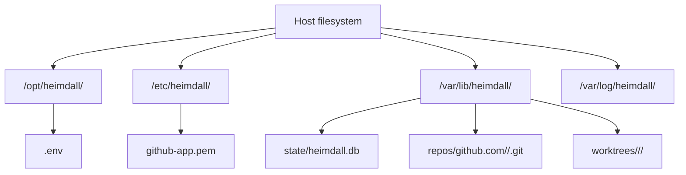

# Operations And Deployment

## Deployment Model

V1 should target one Linux host running one Heimdall process.

Recommended shape:

- systemd-managed binary
- local SQLite database file
- local repo mirrors and worktrees
- outbound HTTPS to GitHub and Linear APIs for the standard workflow path
- optional private HTTP endpoints for health and readiness

## Host Prerequisites

The Linux machine should have:

- `git`
- `openspec`
- `opencode`
- CA certificates for outbound HTTPS
- a writable service data directory

See `setup/linux-host.md` for the full dependency list and host preparation checklist.

If `opencode` requires its own credentials or local runtime setup, that should be treated as a host prerequisite rather than embedded in Heimdall itself.

## Recommended Filesystem Layout



## Configuration Shape

V1 should prefer a project-root `.env` file, with process environment variables able to override it when needed.

Example:

```dotenv
HEIMDALL_SERVER_LISTEN_ADDRESS=:8080
HEIMDALL_SERVER_PUBLIC_URL=http://127.0.0.1:8080
HEIMDALL_STORAGE_DRIVER=sqlite
HEIMDALL_STORAGE_DSN=/var/lib/heimdall/state/heimdall.db
HEIMDALL_LINEAR_POLL_INTERVAL=30s
HEIMDALL_LINEAR_ACTIVE_STATES=In Progress
HEIMDALL_LINEAR_PROJECT_NAME=Core Platform
HEIMDALL_LINEAR_API_TOKEN=replace-with-linear-api-token
HEIMDALL_GITHUB_BASE_BRANCH=main
HEIMDALL_GITHUB_POLL_INTERVAL=30s
HEIMDALL_GITHUB_LOOKBACK_WINDOW=2m
HEIMDALL_GITHUB_APP_ID=123456
HEIMDALL_GITHUB_INSTALLATION_ID=12345678
HEIMDALL_GITHUB_PRIVATE_KEY_FILE=/etc/heimdall/github-app.pem
HEIMDALL_REPOS=PLATFORM
HEIMDALL_REPO_PLATFORM_NAME=github.com/acme/platform
HEIMDALL_REPO_PLATFORM_LOCAL_MIRROR_PATH=/var/lib/heimdall/repos/github.com/acme/platform.git
HEIMDALL_REPO_PLATFORM_DEFAULT_BRANCH=main
HEIMDALL_REPO_PLATFORM_BRANCH_PREFIX=heimdall
HEIMDALL_REPO_PLATFORM_LINEAR_TEAM_KEYS=ENG
HEIMDALL_REPO_PLATFORM_ALLOWED_AGENTS=gpt-5.4,claude-sonnet
HEIMDALL_REPO_PLATFORM_ALLOWED_USERS=mngeow
HEIMDALL_REPO_PLATFORM_PR_MONITOR_LABEL=heimdall-monitored
```

Notes:

- `dist.env` should be committed as the documented template, while the live `.env` file remains gitignored
- Linear polling in v1 is scoped to the configured project name in `HEIMDALL_LINEAR_PROJECT_NAME`
- if only one repo is configured, routing may skip team matching
- if multiple repos are configured, routing rules should be explicit and validated at startup
- GitHub polling should be scoped to managed repositories and managed pull requests to control API volume
- `public_url` does not need to be Internet-reachable when GitHub polling is used; a private or local operator URL is enough if the field is needed at all
- use file-path settings such as `HEIMDALL_GITHUB_PRIVATE_KEY_FILE` when multiline secrets should stay outside the `.env` file

## Health And Observability

V1 should expose a minimal but useful operations surface:

- `/healthz` for process liveness
- `/readyz` for dependency readiness
- structured logs in JSON or logfmt
- counters for polls, detected transitions, PR creations, comment commands, failures, and retries

Useful log fields:

- `workflow_id`
- `issue_key`
- `repo`
- `action`
- `comment_id`
- `agent`
- `attempt`

See `logging.md` for the full logging strategy and log-viewing commands.

The recommended default is to emit structured logs to stdout and let `systemd` and `journald` collect them.

## Reconciliation Jobs

Because this is automation, V1 should include background reconciliation jobs from the start.

Recommended reconciliation tasks:

- detect workflow runs stuck in `running`
- verify that each active issue still maps to an open PR
- clean up abandoned worktrees after terminal workflow states
- retry failed comment status posts

## Backups And Recovery

For a single-host SQLite deployment, recovery depends on keeping a small set of things safe:

- the SQLite database
- the project-root `.env` file or its equivalent environment-variable source
- the GitHub App private key
- the local bare mirrors if fast recovery matters

The bare mirrors are rebuildable from GitHub. The SQLite database is the critical recovery artifact because it contains cursors, dedupe state, and workflow history.

## Operational Risks To Call Out Early

- GitHub polling intervals and lookback windows must be sized to avoid missed commands and unnecessary API pressure
- a broken local OpenCode installation blocks propose, refine, and apply workflows
- stale repo mirrors can create confusing branch failures if fetch and prune are not enforced
- if the machine clock is wrong, polling windows and audit timestamps become unreliable
