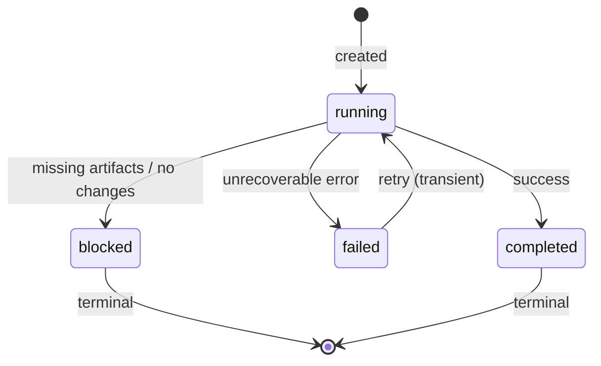
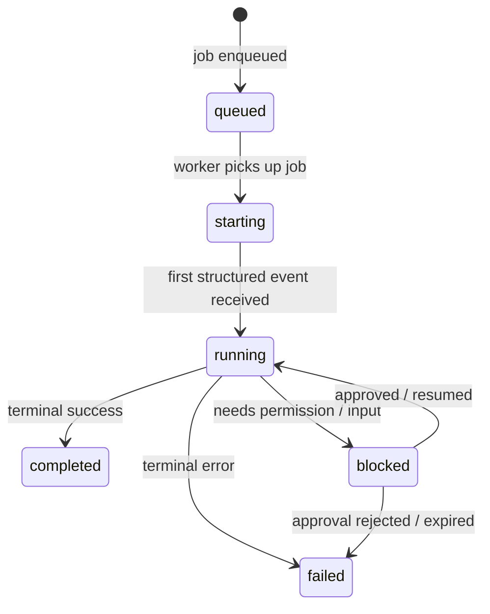
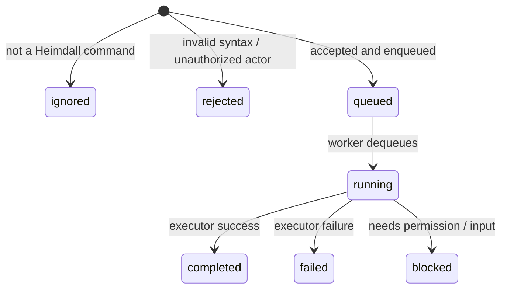
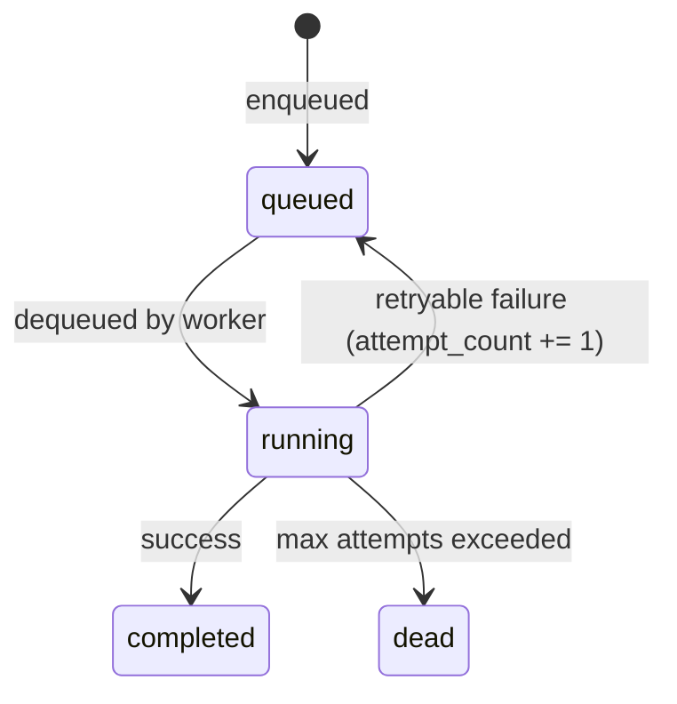
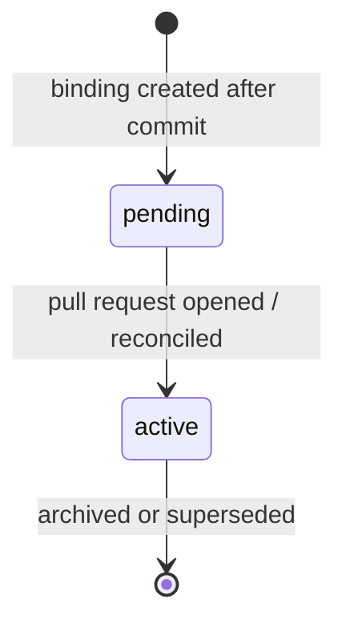
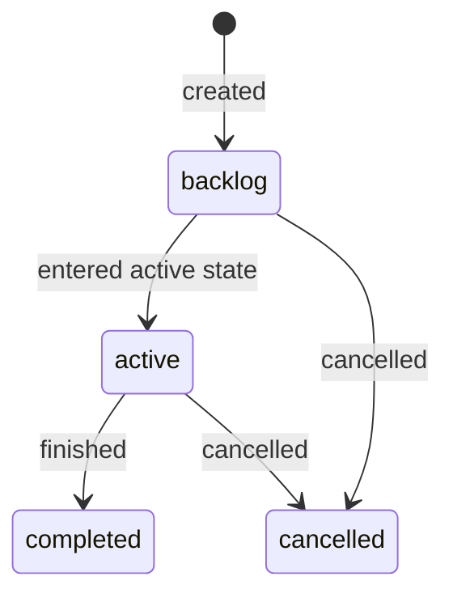

# Runtime State And Status Transitions

Heimdall tracks durable runtime state in SQLite for every automation artifact. This document describes the state machines that govern each artifact, the valid transitions between states, and how the system recovers state after a restart.

## Why State Machines Matter

Because V1 uses polling instead of webhooks, the same comment or transition can be observed more than once. Explicit state machines let Heimdall distinguish:

- **New work** from **duplicate observations**
- **Retryable failures** from **permanent blocks**
- **In-flight execution** from **completed execution**

Every state change is persisted to SQLite before outward side effects (PR comments, git pushes) are attempted.

---

## Artifact State Machines

### 1. Workflow Run

A `WorkflowRun` represents a single end-to-end automation flow such as an activation-triggered proposal or an archive action.

**States:**

| State | Meaning |
|-------|---------|
| `running` | Workflow is actively executing steps |
| `completed` | All steps finished successfully |
| `failed` | A step encountered an unrecoverable error (e.g., API failure, git error) |
| `blocked` | Workflow cannot continue due to business rules (e.g., no proposal artifacts produced, change is incomplete) |

**Rules:**
- A workflow run is created with status `running`.
- Step outcomes are recorded in `workflow_steps`.
- The run reaches `completed` only after all required steps succeed.
- `blocked` is terminal; operator intervention (e.g., a PR comment) creates a new workflow or command run rather than resuming the blocked one.
- `failed` runs may be retried by the reconciliation loop or a new triggering event.

---

### 2. Command Run

A `CommandRun` tracks the execution of an opencode-backed PR command (`/heimdall refine`, `/heimdall apply`, `/heimdall opencode`). It provides the live-execution state visible in the operator dashboard.

**States:**

| State | Meaning |
|-------|---------|
| `queued` | Job is waiting in the queue |
| `starting` | Worker has dequeued the job and is preparing the worktree |
| `running` | Opencode process is executing and emitting structured events |
| `completed` | Opencode session finished successfully |
| `failed` | Opencode session failed or was rejected |
| `blocked` | Opencode requested permission or clarification input |

**Rules:**
- State transitions are persisted durably so the dashboard can reflect them without reading host logs.
- The canonical `sessionID` observed from the first structured event is stored on the `CommandRun`.
- Timeline entries (`command_timeline_entries`) append in observed stream order.
- Terminal states (`completed`, `failed`, `blocked`) stop or slow live-tail polling in the dashboard.

---

### 3. Command Request

A `CommandRequest` represents a single PR comment that Heimdall observed, parsed, and evaluated. It is the intake-side counterpart to the execution-side `CommandRun`.

**States:**

| State | Meaning |
|-------|---------|
| `ignored` | Comment was not a recognized Heimdall command |
| `rejected` | Command failed validation or authorization |
| `queued` | Command was accepted and a job was enqueued |
| `running` | Worker is executing the command |
| `completed` | Command executed successfully |
| `failed` | Command execution failed |
| `blocked` | Command blocked on permission or input request |

**Rules:**
- Intake deduplicates by `dedupe_key` (`github-comment:<node-id>`) before creating a new request.
- `ignored` and `rejected` requests are still persisted so duplicate observations are harmless.
- Accepted commands receive feedback (eyes reaction + dashboard link) before execution starts.
- The `sessionID` from the opencode run is backfilled into the command request for correlation.

---

### 4. Job

A `Job` is the async work unit queued for the worker. Jobs can be tied to workflow runs or command requests.

**States:**

| State | Meaning |
|-------|---------|
| `queued` | Waiting to be picked up |
| `running` | Currently being processed |
| `completed` | Finished successfully |
| `dead` | Failed and exceeded max attempts |

**Rules:**
- Dequeue uses a serializable transaction and excludes jobs whose `lock_key` is already `running`.
- Lock keys prevent concurrent mutation of the same issue, repository, or pull request.
- Retry delay is configurable per failure; the default is immediate requeue with `attempt_count` incremented.

---

### 5. Repo Binding

A `RepoBinding` ties a work item to a specific repository branch and OpenSpec change.

**States:**

| State | Meaning |
|-------|---------|
| `pending` | Branch committed but PR not yet opened or reconciled |
| `active` | PR is open and tracked |

**Rules:**
- Only one active binding per `(work_item_id, repository_id)` pair.
- Re-observing an already-active work item reuses the existing binding instead of creating a duplicate.
- The binding stores the current `last_head_sha` for change-detection during reconciliation.

---

### 6. Work Item Lifecycle Buckets

Work items transition between lifecycle buckets as the board provider polls. The core engine only cares about normalized buckets, not provider-specific state names.

**Buckets:**

| Bucket | Meaning |
|--------|---------|
| `backlog` | Not yet active (e.g., Linear "Todo", "Backlog") |
| `active` | In progress (e.g., Linear "In Progress") |
| `completed` | Done (e.g., Linear "Done") |
| `cancelled` | Cancelled or duplicate |

**Rules:**
- The Linear adapter maps provider state names into buckets using configured `HEIMDALL_LINEAR_ACTIVE_STATES`.
- A transition event (`entered_active_state`) is emitted only when the stored snapshot was outside `active` and the current poll shows `active`.
- Future board providers (e.g., Jira) can define their own state-to-bucket mappings without changing the core engine.

---

## Persistence And Recovery

All state transitions are written to SQLite before outward side effects:

1. Intake persists the `CommandRequest` before posting feedback.
2. The worker marks the job `running` inside the dequeue transaction.
3. The executor updates `CommandRun` status before emitting PR comments.
4. The proposal workflow updates `WorkflowRun` status before pushing branches.

**Recovery after restart:**
- On startup, Heimdall loads existing state from SQLite.
- Pollers resume from the last saved checkpoint (`provider_cursors`).
- The worker continues dequeuing jobs that were `queued` or retryable.
- In-flight `running` jobs from a previous process are treated as stale by the reconciliation loop (they can be requeued or failed based on age).

## Audit Trail

Every mutation leaves an `audit_events` record that answers:

- Who requested it (`actor_login`)
- Which workflow or command run executed it (`workflow_run_id`, `command_request_id`)
- Which agent was used (`agent_name`)
- Which commit was created (`commit_sha`)
- Whether it succeeded, failed, or blocked (`severity`, `summary`)

## Related Documentation

- `docs/workflows.md` — End-to-end flows for proposal, refine, apply, and archive
- `docs/architecture.md` — Runtime architecture and package layout
- `docs/database/schema.md` — SQLite table definitions and ERD
- `docs/worker-execution.md` — Worker boot, dequeue semantics, and execution model
