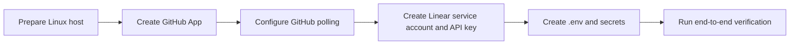

# Symphony Setup

This folder explains how to prepare a Linux host, GitHub, and Linear so Symphony can run end-to-end.

Recommended setup order:

## Files In This Folder

- `linux-host.md`: required host dependencies, filesystem layout, networking, and service-account expectations
- `github.md`: exact GitHub App permissions, polling setup, installation steps, and repository notes
- `linear.md`: exact Linear account, API key, polling scope, and active-state mapping setup

## V1 Setup Principles

- Symphony is designed for one Linux host and one operator-owned deployment.
- Linear is polled, so no Linear webhook setup is required in v1.
- GitHub PR command intake is also polling-based, so no public GitHub webhook endpoint is required in v1.
- OpenSpec and OpenCode run locally, so their CLIs must already work on the host.
- Secrets should be supplied through environment variables or root-readable files outside git.

## High-Level Checklist

1. Prepare the Linux host and install the required tools.
2. Create the GitHub App and install it on the target repositories.
3. Configure the GitHub polling interval and lookback window.
4. Create a dedicated Linear account for Symphony and generate its API key.
5. Copy `dist.env` to the project-root `.env` file and fill in the required values.
6. Start Symphony under `systemd`.
7. Move a test Linear issue into the configured active state.
8. Verify branch creation, OpenSpec proposal generation, PR creation, and PR comment handling.
