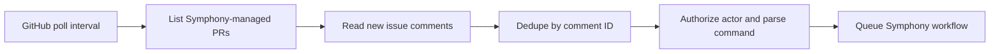

# GitHub Setup

## Purpose

Symphony should use a GitHub App for repository access, pull request creation, pull request comments, and polling-based pull request command intake.

V1 should not use a personal access token.

V1 should also not require a public GitHub webhook endpoint. Under this setup model, Symphony only needs outbound HTTPS access to the GitHub API.

This document reflects the polling-based GitHub model requested for Symphony. The broader repo-wide design follow-up is tracked in `openspec/changes/poll-github-pr-commands/`.

## Polling Model At A Glance

Instead of asking GitHub to push events into Symphony, Symphony should wake up on a fixed interval, read new pull request activity through the GitHub API, and then decide whether any supported command was posted on a Symphony-managed pull request.



Important consequences:

- no public DNS name is required for GitHub event intake
- no inbound firewall rule is required for GitHub event intake
- no GitHub webhook secret is required for the normal v1 setup path
- command latency is now bounded by the polling interval instead of arriving in real time

## What You Need Before Starting

- the GitHub organization or user account that owns the repository
- the repository or repositories Symphony should manage
- permission to create and install a GitHub App on those repositories
- outbound HTTPS from the Symphony host to `github.com` and `api.github.com`
- a place to store the GitHub App private key outside git
- optionally, the `gh` CLI if you want an easy way to inspect installation details from the terminal

You do not need:

- a public HTTPS URL for Symphony
- a reverse proxy just for GitHub event delivery
- a webhook secret

## Step 1: Create Or Reconfigure The GitHub App

Create a GitHub App dedicated to Symphony.

If you already created one for webhook delivery, you can usually keep the same app and edit its settings so it no longer expects webhook traffic.

Recommended values when creating or editing the app:

- App name: `Symphony`
- Description: optional, but it is helpful to note that this app is used for polling-based Symphony automation
- Homepage URL: your project or operator docs URL
- Callback URL: leave blank unless you later add a user-auth flow
- Request user authorization during installation: off
- Device flow: off
- Setup URL: blank unless you have your own operator onboarding page
- Active: disabled or unchecked
- Webhook URL: leave blank
- Webhook secret: leave blank

Precise GitHub UI detail:

- the critical setting is the GitHub App "Active" checkbox in the webhook section
- when "Active" is disabled, GitHub does not send webhook deliveries for the app
- once webhook delivery is disabled, the webhook URL and webhook secret are not needed for Symphony's normal v1 flow

If you are converting an existing app from webhook mode to polling mode:

1. Open the GitHub App settings page.
2. Find the webhook section.
3. Disable the "Active" setting.
4. Remove any old webhook URL if GitHub still shows one.
5. Remove any stored webhook secret from your host secret store.
6. Save the app settings.

## Step 2: Configure Repository Permissions

Use the smallest permissions that still allow Symphony to function.

Recommended repository permissions:

- Metadata: read-only
- Contents: read and write
- Pull requests: read and write
- Issues: read and write

Why these are needed:

- Metadata lets Symphony inspect repository identity and installation scope.
- Contents lets Symphony push proposal and apply branches.
- Pull requests lets Symphony create, read, and update pull requests.
- Issues lets Symphony read and write pull request comments because GitHub exposes PR comments through the issues API surface.

Do not add broader permissions until there is a concrete need.

## Step 3: Do Not Subscribe To Webhook Events

Under the polling model, GitHub does not need to deliver `issue_comment` or `pull_request` events to Symphony.

That means:

- leave webhook delivery disabled
- do not configure webhook event subscriptions for the normal v1 path
- do not provision a public `/webhooks/github` endpoint just for GitHub command handling

Operator note:

- pull request comments are still represented as issue comments in GitHub's data model
- that detail matters for API polling logic, but not for GitHub App webhook setup, because webhooks are intentionally not used here

## Step 4: Generate The Private Key

After the app is created:

1. Generate a private key from the GitHub App settings page.
2. Store it in a root-readable path outside the repository, for example `/etc/symphony/github-app.pem`.
3. Set restrictive file permissions such as `0400` or `0600`.
4. Record the GitHub App ID.

Example:

```bash
install -m 0400 /path/to/downloaded/private-key.pem /etc/symphony/github-app.pem
```

Treat the private key as a critical recovery asset. Anyone with the private key and app metadata can mint installation tokens.

## Step 5: Install The App On Target Repositories

Install the app on every repository Symphony should manage.

If you only want Symphony to manage a subset of repositories, install it only on that subset.

After installation, record the installation ID if your deployment uses a single installation.

Precise ways to find the installation ID:

1. GitHub UI path:
   open the installation configuration page for the repository or organization and inspect the installation details page.
2. `gh` CLI path:

```bash
gh api "/repos/<owner>/<repo>/installation" --jq '.id'
```

That command is useful when you are authenticated in `gh` as a user who can inspect the target repository installation.

## Step 6: Choose Polling Settings Carefully

Polling removes the public ingress requirement, but it introduces timing and rate-limit choices that must be explicit.

Recommended starting values for v1:

- poll interval: `30s`
- overlap or lookback window: `2m`
- pull request scope: only repositories Symphony manages, and preferably only open Symphony-managed pull requests

How to choose these values:

- A `30s` poll interval keeps command latency low enough for normal operator use without creating unnecessary API pressure.
- A `2m` overlap or lookback window gives Symphony room to survive clock skew, temporary GitHub API lag, process restarts, or a missed poll cycle.
- Restricting the scope to Symphony-managed pull requests keeps the poller predictable and avoids scanning unrelated repository traffic.

Operational rule:

- the lookback window should be larger than the poll interval
- Symphony should dedupe by stable comment identity, not by timestamp alone
- overlapping windows are expected and safe only if command deduplication is durable

## Step 7: Wire The App Into Symphony `.env` And Secrets

Set these entries in the project-root `.env` file or the process environment:

```bash
SYMPHONY_GITHUB_APP_ID=<app-id>
SYMPHONY_GITHUB_INSTALLATION_ID=<installation-id>
SYMPHONY_GITHUB_PRIVATE_KEY_FILE=/etc/symphony/github-app.pem
```

Do not set `SYMPHONY_GITHUB_WEBHOOK_SECRET` for the polling-based setup path.

Your Symphony environment-variable schema should capture, at minimum, these GitHub-side semantics:

- base branch, usually `main`
- GitHub polling interval
- GitHub overlap or lookback window
- repo routing rules
- allowed GitHub users
- allowed apply agents

One reasonable polling-oriented `.env` shape is:

```dotenv
SYMPHONY_GITHUB_BASE_BRANCH=main
SYMPHONY_GITHUB_POLL_INTERVAL=30s
SYMPHONY_GITHUB_LOOKBACK_WINDOW=2m
```

If your exact config schema differs, preserve the same meaning even if the final field names change.

## Step 8: Know What Symphony Should Poll

For GitHub command intake, Symphony should perform a narrow polling loop rather than a broad repository crawl.

Recommended cycle behavior:

1. Load the last successful GitHub polling checkpoint from SQLite.
2. Compute a safe read window such as `last_successful_poll - lookback_window`.
3. Enumerate only the repositories managed by Symphony.
4. Enumerate only the open pull requests Symphony already manages, or another equivalently narrow managed-PR set.
5. Read issue comments that are new within the polling window.
6. Ignore comments on non-Symphony pull requests.
7. Ignore comment edits in v1.
8. Dedupe every candidate command by stable comment ID or node ID before starting work.
9. Authorize the commenter before running any mutation workflow.
10. Persist the new successful checkpoint only after the cycle finishes cleanly.

This matters because polling correctness depends more on durable checkpoints and dedupe than on the exact timestamp returned by any single API call.

## Step 9: Confirm Branch Rules Will Not Block Symphony

Symphony creates and pushes branches like `symphony/<issue-key>-<slug>`.

Check that:

- the app can push new branches
- branch protection rules do not accidentally match and block `symphony/*`
- pull requests can target `main`

## Step 10: Verify Polling End To End

After Symphony is running:

1. Confirm the host has outbound HTTPS access to GitHub.
2. Confirm there is no dependency on public inbound GitHub webhook traffic.
3. Create or reuse a Symphony-managed pull request.
4. Add a test comment such as `/symphony status` from an allowed GitHub user.
5. Wait one or two poll intervals.
6. Confirm Symphony detects the comment and posts its response or audit-visible result.
7. Add a second command such as `/symphony refine Clarify rollback behavior.` and verify it is also detected after polling.
8. Confirm the same comment is not executed twice if the polling windows overlap.

If end-to-end verification fails, check these first:

- the GitHub App is installed on the correct repository
- the GitHub App private key path is correct and readable
- the installation ID is correct
- the polling interval and lookback window are configured
- the repository is actually managed by Symphony routing
- the commenting user is in the allowed-user set
- the test pull request is a Symphony-managed pull request, not an unrelated PR

## Minimal Per-Repo Checklist

For each managed repository, verify:

- the app is installed
- webhook delivery is disabled for the app
- `main` is the intended base branch
- the repo accepts pull requests from `symphony/*` branches
- the repo appears in `SYMPHONY_REPOS`
- `SYMPHONY_REPO_<ID>_ALLOWED_USERS` contains the operators who may run commands
- `SYMPHONY_REPO_<ID>_ALLOWED_AGENTS` contains the agent names permitted for `/opsx-apply`
- the GitHub polling interval and lookback semantics are configured for that deployment

## Easy-To-Miss GitHub Details

- No public GitHub webhook endpoint is required in this setup model.
- PR comments still live under GitHub's issue-comment model even when you do not use webhooks.
- Polling introduces intentional delay; the user-visible delay is usually one poll interval plus processing time.
- The overlap or lookback window must be larger than zero, or restart and clock-skew gaps can drop commands.
- Dedupe by comment identity, not only by `created_at`, or the same command can run twice.
- Installing the app on the organization is not enough if it is not granted access to the target repositories.
- The GitHub App private key remains a critical recovery asset even though the webhook secret is gone.
- Symphony should only process mutation commands on pull requests that it created or explicitly adopted.
