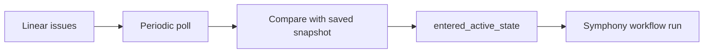

# Linear Setup

## Purpose

Symphony polls Linear for issues entering an active state. In v1, this integration uses polling and an API key, not Linear webhooks.

## Recommended Account Model

Use a dedicated Linear account for Symphony so the integration is isolated from a personal user account.

That account should:

- belong to the correct workspace
- be able to read the Linear project Symphony will monitor
- have visibility into the issue titles and descriptions that will seed OpenSpec proposals

## Step 1: Create Or Choose The Symphony Linear Account

Create a dedicated Linear user for Symphony if your workspace allows it.

If you do not want a separate account in v1, use one operator-owned account, but understand that the API key then belongs to that user context.

## Step 2: Generate The Linear API Key

Generate an API key from the Linear account that Symphony will use.

Store it outside git and inject it into the service environment:

```bash
SYMPHONY_LINEAR_API_TOKEN=<linear-api-key>
```

Symphony uses that static API key against `https://api.linear.app/graphql` with the documented `Authorization: <API_KEY>` header form.

## Step 3: Choose The Linear Project To Poll

For v1, Symphony polls one configured Linear project. Set that project name in the project-root `.env` file:

```dotenv
SYMPHONY_LINEAR_PROJECT_NAME=Core Platform
```

If the Linear project is renamed later, update `.env` before restarting Symphony.

## Step 4: Choose The Active-State Mapping

Symphony needs to know which Linear states should count as entering active work.

For the first version, this is a dotenv-driven mapping such as:

```dotenv
SYMPHONY_LINEAR_POLL_INTERVAL=30s
SYMPHONY_LINEAR_ACTIVE_STATES=In Progress
SYMPHONY_LINEAR_PROJECT_NAME=Core Platform
```

If different workflows use different state names, include all relevant active state names in `.env` or the service environment.

## Step 5: Prepare Linear Ticket Conventions

Because Symphony turns issue text into OpenSpec proposals, each tracked issue should have:

- a useful title
- a meaningful description
- enough product or engineering context to seed the first proposal and design

Short or empty descriptions will produce weak proposals.

## Step 6: Verify The Polling Model

V1 does not need any Linear webhook configuration.

Instead, Symphony will:

1. poll for recently updated issues
2. filter those issues to the configured Linear project name
3. compare the current state to the last saved snapshot
4. emit an internal `entered_active_state` event when the issue crosses into an active state



## Step 7: End-To-End Verification

After Symphony is running:

1. Create a test issue in the monitored Linear project.
2. Confirm the issue belongs to the configured Linear project.
3. Add a title and description that a spec generator can work from.
4. Move the issue into one of the configured active states.
5. Wait for the next poll interval.
6. Verify Symphony opens the expected PR in GitHub.

## Easy-To-Miss Linear Details

- No Linear webhook is required in v1.
- State-name changes in Linear must be reflected in Symphony's environment-variable configuration.
- If the dedicated Linear account cannot see the configured Linear project, Symphony will silently miss those issues.
- If Linear rate-limits the API key, Symphony should retry on the next poll cycle without advancing the saved checkpoint.
- The issue description quality directly affects the quality of the generated proposal.
