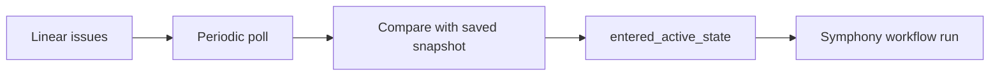

# Linear Setup

## Purpose

Symphony polls Linear for issues entering an active state. In v1, this integration uses polling and an API key, not Linear webhooks.

## Recommended Account Model

Use a dedicated Linear account for Symphony so the integration is isolated from a personal user account.

That account should:

- belong to the correct workspace
- be able to read the teams or projects Symphony will monitor
- have visibility into the issue titles and descriptions that will seed OpenSpec proposals

## Step 1: Create Or Choose The Symphony Linear Account

Create a dedicated Linear user for Symphony if your workspace allows it.

If you do not want a separate account in v1, use one operator-owned account, but understand that the API key then belongs to that user context.

## Step 2: Generate The Linear API Key

Generate an API key from the Linear account that Symphony will use.

Store it outside git and inject it into the service environment:

```bash
SYMPHONY_LINEAR_API_TOKEN=<linear-api-key>
```

## Step 3: Choose What Symphony Polls

Decide which Linear scope Symphony should monitor:

- one team
- several teams
- one project
- label-scoped subsets inside a team

V1 routing should be explicit. If multiple GitHub repositories are involved, do not rely on guesswork.

## Step 4: Choose The Active-State Mapping

Symphony needs to know which Linear states should count as entering active work.

For the first version, this is a config-driven mapping such as:

```yaml
linear:
  poll_interval: 30s
  active_states:
    - "In Progress"
  team_keys:
    - "ENG"
```

If different teams use different state names, include all relevant values in config.

## Step 5: Prepare Linear Ticket Conventions

Because Symphony turns issue text into OpenSpec proposals, each tracked issue should have:

- a useful title
- a meaningful description
- enough product or engineering context to seed the first proposal and design

Short or empty descriptions will produce weak proposals.

## Step 6: Verify The Polling Model

V1 does not need any Linear webhook configuration.

Instead, Symphony will:

1. poll for recently updated issues
2. compare the current state to the last saved snapshot
3. emit an internal `entered_active_state` event when the issue crosses into an active state



## Step 7: End-To-End Verification

After Symphony is running:

1. Create a test issue in the monitored team or project.
2. Add a title and description that a spec generator can work from.
3. Move the issue into one of the configured active states.
4. Wait for the next poll interval.
5. Verify Symphony opens the expected PR in GitHub.

## Easy-To-Miss Linear Details

- No Linear webhook is required in v1.
- State-name changes in Linear must be reflected in Symphony config.
- If the dedicated Linear account cannot see a team or project, Symphony will silently miss those issues.
- The issue description quality directly affects the quality of the generated proposal.
