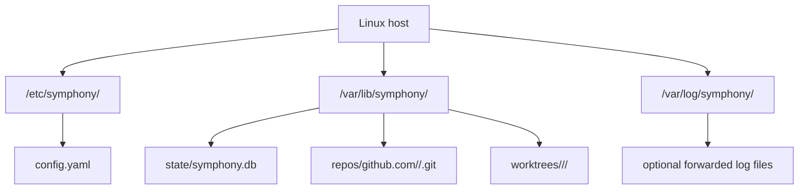

# Linux Host Setup

## Purpose

This document lists the Linux-side dependencies Symphony needs and the host preparation steps required before GitHub and Linear integration will work.

## Required Runtime Dependencies

Symphony should run as a single compiled Go binary, but the host still needs these external dependencies:

- `git`
- `openspec`
- `opencode`
- CA certificate bundle for outbound HTTPS
- `systemd` and `journald` for service supervision and log collection
- writable persistent storage for config, SQLite, repo mirrors, worktrees, and logs

## Optional But Recommended Operator Tools

These are not runtime requirements for Symphony itself, but they make troubleshooting much easier:

- `sqlite3`
- `jq`
- `curl`
- `rg`

## Not Required

These should not be required on the production host if Symphony is shipped as a compiled binary:

- a Go toolchain
- a separate database server
- a public reverse proxy for GitHub command intake
- a public reverse proxy for Linear intake
- a browser-based admin UI

## Recommended Host Filesystem Layout



## Service Account Expectations

The Symphony service account should be able to:

- read `/etc/symphony/config.yaml`
- read the GitHub App private key file if stored separately
- read environment-backed secrets injected by the service manager
- create and modify files under `/var/lib/symphony/`
- execute `git`, `openspec`, and `opencode`
- open outbound HTTPS connections to GitHub and Linear

It should not need shell access broader than its working directories.

## Network Requirements

Outbound access:

- GitHub API and git-over-HTTPS endpoints
- Linear API endpoints

Inbound access:

- no public inbound GitHub or Linear webhook access for the standard v1 workflow path
- optional private access to health and readiness endpoints if the operator wants remote checks

Both provider integrations are polling-based in v1, so outbound HTTPS is the critical networking requirement.

## Dependency Installation Notes

`git` and `ca-certificates` should come from the Linux distribution packages.

`openspec` and `opencode` should be installed according to their upstream installation instructions and verified on the service account's `PATH` before Symphony is started.

## Verification Commands

Before starting Symphony, verify these commands work under the intended service account:

```bash
git --version
openspec --version
opencode --version
```

## Final Host Checklist

1. Create the service account.
2. Install `git`, `openspec`, `opencode`, and CA certificates.
3. Create `/etc/symphony/`, `/var/lib/symphony/`, and `/var/log/symphony/`.
4. Place the config file and secrets.
5. Confirm outbound HTTPS works to GitHub and Linear.
6. Confirm the system clock is synchronized.
7. Start Symphony with `systemd`.
