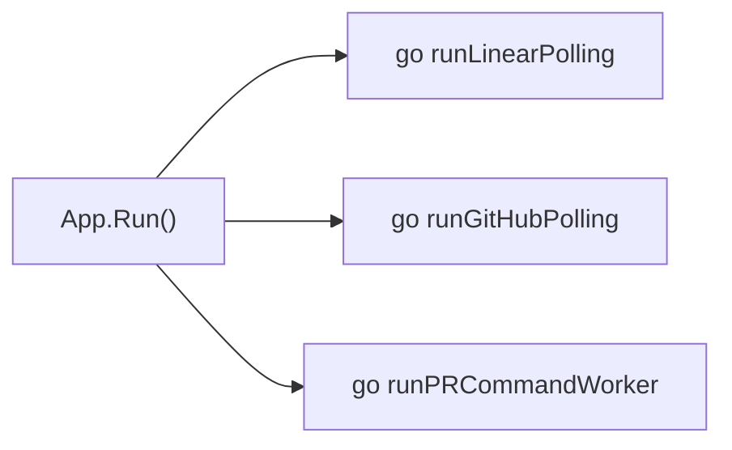
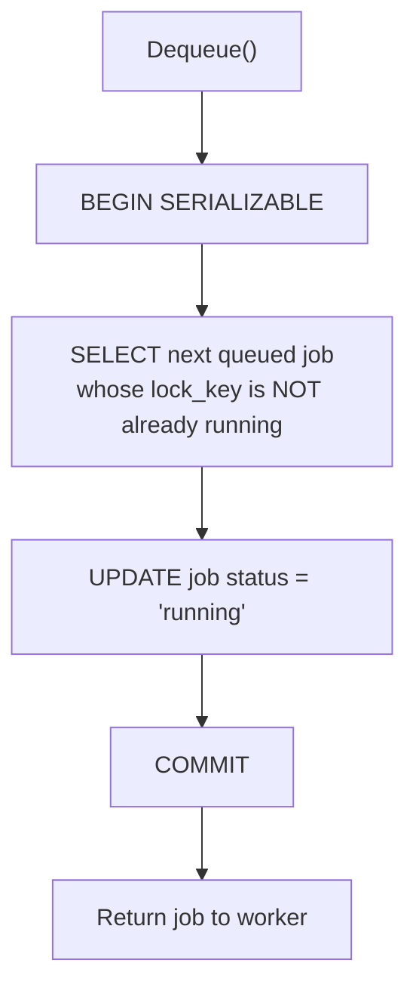
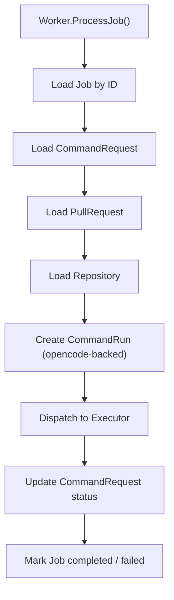
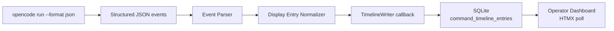
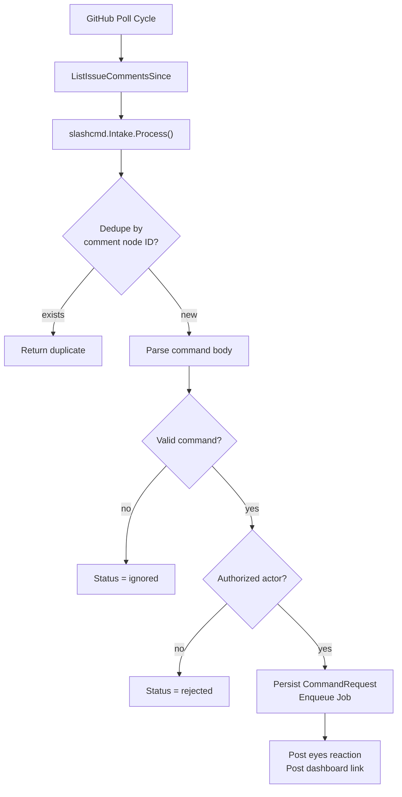

# Worker Execution And PR Comment Intake

Heimdall executes long-running PR commands asynchronously through a background worker. This document describes how the worker boots, how it dequeues and executes jobs, and how the PR comment intake pipeline feeds work into it.

## Boot Sequence

When the Heimdall process starts, the application layer (`internal/app/app.go`) initializes three background goroutines:



The worker goroutine runs for the lifetime of the process:

```go
func (a *App) runPRCommandWorker(ctx context.Context) {
    for {
        select {
        case <-ctx.Done():
            return
        default:
        }
        if err := a.prCommandWorker.ProcessJob(ctx); err != nil {
            a.logger.Error("pr command job failed", "error", err)
        }
    }
}
```

There is **one worker goroutine** in V1. It loops forever, sleeping implicitly when no jobs are available (`Dequeue` returns nil).

## Job Dequeue Semantics

The worker dequeues jobs through `JobQueue.Dequeue`, which uses a **serializable transaction** to guarantee atomicity:



### Lock Keys

Lock keys prevent concurrent mutation of the same logical resource:

| Resource | Lock Key Format | Example |
|----------|----------------|---------|
| Work item | `issue:<provider>:<key>` | `issue:linear:ENG-123` |
| Repository | `repo:<repo-ref>` | `repo:github.com/acme/platform` |
| Pull request | `pr:<pr-id>` | `pr:42` |

A job whose lock key is already held by another `running` job will not be dequeued until the holder completes or fails.

### Priority And Scheduling

Jobs are ordered by:

1. `priority ASC` (lower number = higher priority)
2. `run_after ASC` (earliest scheduled time first)

The default priority is `100`. Jobs with `run_after > now()` remain invisible until their scheduled time.

## Job Execution Flow

Once dequeued, the worker loads the full execution context from SQLite:



### Durable Identifier Resolution

The worker resolves execution from durable stored IDs, not from the comment body or transient poll state:

- `CommandRequest` ID → parsed command, agent, change name, prompt tail
- `PullRequest` ID → head branch, repository binding, PR number
- `Repository` ID → mirror path, owner, name, credentials

If any of these records are missing, the job is marked failed rather than guessed.

### Command Dispatch

The worker dispatches to the executor based on `job.JobType`:

| Job Type | Executor Method |
|----------|----------------|
| `pr_command_status` | `ExecuteStatus` |
| `pr_command_refine` | `ExecuteRefine` |
| `pr_command_apply` | `ExecuteApply` |
| `pr_command_opencode` | `ExecuteOpencode` |
| `pr_command_approve` | `ExecuteApprove` |

### Opencode Execution And Live Output

For opencode-backed commands (`refine`, `apply`, `opencode`), the worker:

1. Creates or retrieves a `CommandRun` record
2. Updates its status: `queued` → `starting` → `running`
3. Passes a `TimelineWriter` callback to the executor
4. The executor streams structured JSON events from `opencode run --format json`
5. Each event is normalized into a human-readable `CommandTimelineEntry` and appended to SQLite in real time
6. The dashboard polls these entries for live-tail display



### Terminal Outcome Classification

The executor classifies the terminal outcome from the **final** structured events and process exit code, not from the first intermediate error:

- An early empty `tool_use` error followed by successful completion → **success**
- A true failure with no detailed message → **failed** with a non-empty fallback summary
- A permission request event → **blocked** with the exact request ID persisted

## Retry Behavior

When a job fails:

1. The worker marks the `CommandRequest` status as `failed` or `blocked`
2. The worker calls `queue.Fail(ctx, jobID, retryDelay)`
3. If `attempt_count < max_attempts`, the job is requeued with `run_after = now + retryDelay`
4. If max attempts are exceeded, the job status becomes `dead`

Transient failures (network timeouts, rate limits) should set a non-zero `retryDelay`. Permanent failures (unauthorized agent, missing change) should set `retryDelay = 0` so the job is immediately requeued and quickly becomes `dead`.

## PR Comment Intake Pipeline

The intake pipeline runs inside the GitHub poll cycle, before the worker sees the job:



### Stages

1. **Discovery** — `github.Poller` discovers comments via `ListIssueCommentsSince`
2. **Deduplication** — `Intake` checks `command_requests.dedupe_key` for existing records
3. **Parsing** — `slashcmd.Parser` extracts command name, agent, change name, prompt tail
4. **Authorization** — `slashcmd.Authorizer` checks collaborator rights and repository allowlists
5. **Persistence** — `CommandRequest` is saved with status `queued`
6. **Enqueuing** — A `Job` is created with `lock_key = pr:<pr-id>` and enqueued
7. **Feedback** — `eyes` reaction + dashboard link are posted asynchronously; failures do not block execution

### Feedback Idempotency

- The `eyes` reaction is posted at most once per command request (`feedback_reaction_posted` flag)
- The dashboard link comment is posted at most once per command request (`feedback_link_posted` flag)
- If the reaction succeeds but the link comment fails on a transient error, the retry posts only the missing link comment

## Worker-Intake Separation

The intake layer and worker layer are intentionally separated:

| Concern | Intake Layer | Worker Layer |
|---------|-------------|--------------|
| Runs in | GitHub poll goroutine | PR-command worker goroutine |
| Decides | Whether to accept a command | How to execute a command |
| Mutates | `command_requests`, `jobs` | `command_runs`, `workflow_runs`, git, GitHub API |
| Side effects | PR reactions, link comments | PR result comments, git push, opencode execution |
| Latency | Fast (must not block polling) | Slow (may run for minutes) |

This separation keeps polling fast and deterministic while allowing long-running opencode sessions to execute without blocking the poller.

## Recovery After Restart

On restart:

1. The worker goroutine starts immediately
2. It dequeues any jobs that were `queued` before shutdown
3. Jobs that were `running` during shutdown remain `running` in SQLite; the reconciliation loop (or operator) can mark them failed after a timeout
4. In-flight opencode sessions from a previous process are lost; the user must reissue the command

## Related Documentation

- `docs/runtime-state.md` — State machines for jobs, command requests, and command runs
- `docs/github-polling.md` — How the poller discovers comments across repositories
- `docs/architecture.md` — Overall runtime architecture and component boundaries
- `docs/workflows.md` — End-to-end flows for refine, apply, and archive
