# Workflow Design

## Workflow 1: Linear Issue Enters Active State

Because V1 uses polling, Symphony must detect transitions rather than rely on event delivery from Linear.

Recommended polling strategy:

1. Poll Linear on a short interval such as 30 seconds.
2. Query recently updated issues for the configured teams or projects.
3. Compare each issue's current state with the last stored snapshot in SQLite.
4. When the stored state was not active and the current state is active, emit a normalized transition event.
5. Record an idempotency key so retries do not create duplicate work.

Suggested normalized active trigger name:

- `entered_active_state`

That avoids hard-coding `In Progress` deep in the core workflow engine and keeps room for Jira later.

### Propose Flow

```mermaid
flowchart LR
    Poll["Linear poll"] --> Transition["State transition detected"]
    Transition --> Run["Workflow run created"]
    Run --> Repo["Repository resolved"]
    Repo --> Mirror["Repo mirror synced"]
    Mirror --> Worktree["Branch worktree created"]
    Worktree --> Change["OpenSpec change scaffolded"]
    Change --> Artifacts["Spec artifacts generated"]
    Artifacts --> Commit["Commit and push"]
    Commit --> PR["Pull request opened"]
    PR --> Comment["Success comment posted"]
```



Detailed flow:

1. Resolve the target repository.
2. Reconcile whether a branch or PR already exists for this issue.
3. Create or reuse branch `symphony/<issue-key>-<slug>`.
4. Create or reuse OpenSpec change `<issue-key>-<slug>`.
5. Run `openspec new change <name>` if the change does not exist.
6. Run `openspec status --change <name> --json`.
7. Generate required artifacts in dependency order using OpenSpec instructions and local OpenCode execution.
8. Commit the resulting files.
9. Push the branch.
10. Open a PR against `main` if one does not exist.
11. Comment on the PR with the current change name, status, and next available commands.

## Workflow 2: Refine Specs From A PR Comment

Refinement is an artifact-only operation. It should update OpenSpec files but not apply implementation tasks.

In V1, refinement should use the repository's configured default spec-writing agent so the user does not need to supply an agent name for every artifact edit.

Recommended command:

```text
/symphony refine Clarify rollback behavior and add non-goals.
```

Processing steps:

1. Symphony polls GitHub for new comments on Symphony-managed pull requests.
2. Symphony identifies a new `/symphony refine` comment since the last saved checkpoint.
3. Symphony checks that the comment is on a PR, not a plain issue.
4. Symphony checks that the commenter is allowed to issue commands.
5. Symphony deduplicates the request by comment node id.
6. Symphony resolves the branch and associated OpenSpec change.
7. Symphony runs the refinement executor against the worktree.
8. Symphony commits any changed artifacts.
9. Symphony pushes the branch.
10. Symphony comments with a short summary of what changed.

Refinement should be scoped to:

- `proposal.md`
- `design.md`
- `tasks.md`
- specs under `openspec/changes/<change>/specs/` if the schema requires them

## Workflow 3: Apply From A PR Comment

This is the workflow that maps most closely to your requested "do opsx apply with my opencode agent of choice" behavior.

Recommended command syntax:

```text
/opsx-apply <change-name> --agent <agent-name>
```

If the PR only contains one active change, `<change-name>` can be omitted.

Examples:

```text
/opsx-apply --agent gpt-5.4
/opsx-apply eng-123-add-rate-limit --agent claude-sonnet
```

Processing steps:

1. During a GitHub poll cycle, Symphony discovers a new `/opsx-apply` comment on a Symphony-managed pull request.
2. Symphony authorizes the actor and parses the requested agent.
3. Symphony checks that the agent is allowed for the repository.
4. Symphony resolves the branch and worktree for the PR.
5. Symphony asks OpenSpec for apply instructions.
6. If the change is blocked, Symphony comments back with the reason instead of guessing.
7. Symphony runs the apply executor with the selected agent.
8. Symphony commits task-file updates and code changes together.
9. Symphony pushes the branch.
10. Symphony comments back with completed tasks, remaining tasks, or blockers.

## Workflow 4: Archive From A PR Comment

Archive is optional in V1, but the design should leave room for it.

Recommended command:

```text
/opsx-archive <change-name>
```

If archive is implemented later, Symphony should follow the OpenSpec guardrails already present in the repo:

- never guess the change when multiple are active
- warn about incomplete artifacts
- warn about incomplete tasks
- preserve the archived change directory under `openspec/changes/archive/`

## Command Surface

The initial command surface should stay small:

- `/symphony status`
- `/symphony refine <instruction>`
- `/opsx-apply [change-name] --agent <agent-name>`
- `/opsx-archive [change-name]`

Notes:

- `/symphony refine` is a Symphony-native command because refinement is broader than a single stock OpenSpec command.
- `/opsx-apply` and `/opsx-archive` keep the OpenSpec mental model visible to the user.
- comment edits should be ignored in V1; only initial comment creation should trigger execution.

## Idempotency Rules

Idempotency is critical because polling and repeated API observations both happen in real systems.

Symphony should dedupe at these boundaries:

- Linear transition detection
- branch and PR creation
- PR comment command execution
- retry of propose, refine, and apply actions

Recommended idempotency keys:

- `linear:<issue-id>:entered_active_state:<timestamp-or-version>`
- `repo:<repo>:issue:<issue-key>:branch`
- `repo:<repo>:issue:<issue-key>:pr`
- `github-comment:<comment-node-id>`

## Failure Handling

Every workflow should distinguish transient failures from permanent ones.

Transient examples:

- GitHub API rate limits
- temporary git push failure
- OpenCode process timeout

Permanent examples:

- no repository mapping for the issue
- unauthorized comment actor
- requested agent not on the allowlist
- blocked OpenSpec change with missing artifacts

Failure behavior should be consistent:

- record the failure in SQLite
- retry transient failures with backoff
- post a short PR comment for permanent failures that the user can act on
- never leave the user guessing whether Symphony saw the request
