# Workflow Design

## Workflow 1: Linear Issue Enters Active State

Because V1 uses polling, Heimdall must detect transitions rather than rely on event delivery from Linear.

Recommended polling strategy:

1. Poll Linear on a short interval such as 30 seconds.
2. Query recently updated issues for the configured Linear project.
3. Compare each issue's current state with the last stored snapshot in SQLite.
4. When the stored state was not active and the current state is active, emit a normalized transition event.
5. Record an idempotency key so retries do not create duplicate work.

Suggested normalized active trigger name:

- `entered_active_state`

That avoids hard-coding `In Progress` deep in the core workflow engine and keeps room for Jira later.

### Activation Proposal PR Flow

```mermaid
flowchart LR
    Poll["Linear poll"] --> Transition["State transition detected"]
    Transition --> Run["Workflow run created"]
    Run --> Repo["Repository resolved"]
    Repo --> Mirror["Repo mirror synced"]
    Mirror --> Worktree["Branch worktree created"]
    Worktree --> Change["OpenSpec change created or reused"]
    Change --> Status["OpenSpec status and instructions read"]
    Status --> Proposal["Proposal artifacts generated via opencode"]
    Proposal --> Check["No-change check"]
    Check --> Commit["Commit and push"]
    Commit --> PR["Pull request opened or reused"]
```



Detailed flow:

1. Resolve the target repository.
2. Reconcile whether a branch, change, or PR already exists for this issue.
3. Create or reuse branch `heimdall/<issue-key>-<description-or-title-slug>`.
4. Derive deterministic change name `<issue-key>-<description-or-title-slug>` (lowercased).
5. Ensure the configured bare mirror exists at `HEIMDALL_REPO_<id>_LOCAL_MIRROR_PATH`.
6. Create a worktree from that mirror for the proposal branch.
7. Create or reuse the OpenSpec change through the local `openspec` CLI.
8. Read OpenSpec CLI status and artifact instructions to determine which artifacts are required.
9. Run local `opencode` with the repository's configured default spec-writing agent, using the Linear issue title and description as prompt context.
10. Repeat artifact generation until the apply-required artifacts are complete.
11. Fail the workflow as blocked if the proposal run leaves no repository changes.
12. Commit the generated OpenSpec artifacts.
13. Push the branch by using a GitHub App installation token.
14. Open or reuse a proposal PR against `main` with the source issue context and generated change name in the title and body.
15. Apply the configured PR monitor label when present.
16. Emit structured logs for each major workflow step so operators can follow progress and diagnose failures from the host journal.

## Workflow 2: PR-Command Execution Model

All PR-comment commands, including `/heimdall status`, follow the same execution model:

1. A GitHub poll cycle observes a new issue comment on a Heimdall-managed pull request.
2. Heimdall checks that the comment is on a PR, not a plain issue.
3. Heimdall checks that the commenter is allowed to issue commands.
4. Heimdall deduplicates the command by comment node id or another stable comment identity.
5. Heimdall saves the command request and enqueues a PR-command job.
6. The PR-command worker dequeues the job and loads the persisted command request, pull request, and repository by their durable stored IDs.
7. The worker dispatches the job to the matching executor, executes it, and posts a PR reply if applicable.
8. The worker updates the command request and job state to completed, blocked, or failed.
9. Duplicate later poll observations of the same comment are ignored and must not produce additional outcomes.

This model keeps polling fast and deterministic while executing commands asynchronously through a single background worker loop.

## Workflow 3: Refine Specs From A PR Comment

Refinement is an artifact-only operation. It should update OpenSpec files but not apply implementation tasks.

In V1, both activation-triggered proposal generation and `/heimdall refine` use the repository's configured default spec-writing agent so the user does not need to supply an agent name for every artifact edit.

Recommended command:

```text
/heimdall refine Clarify rollback behavior and add non-goals.
```

Scope:

- `proposal.md`
- `design.md`
- `tasks.md`
- specs under `openspec/changes/<change>/specs/` if the schema requires them

## Workflow 3: Apply From A PR Comment

This is the workflow that maps most closely to your requested "do opsx apply with my opencode agent of choice" behavior.

Recommended command syntax:

```text
/opsx-apply <change-name> --agent <agent-name>
```

If the PR only contains one active change, `<change-name>` can be omitted.

Examples:

```text
/opsx-apply --agent gpt-5.4
/opsx-apply eng-123-add-rate-limit --agent claude-sonnet
```

Processing steps:

1. A GitHub poll cycle observes the comment on a Heimdall-managed pull request.
2. The command intake saves a command request and enqueues a PR-command job.
3. The PR-command worker dequeues the job by its durable ID.
4. The worker loads the persisted command request, pull request, and repository.
5. The worker authorizes the actor and parses the requested agent.
6. The worker checks that the agent is allowed for that repository.
7. The worker resolves the branch and worktree for the PR.
8. The worker asks OpenSpec for apply instructions.
9. If the change is blocked, the worker comments back with the reason instead of guessing.
10. The worker runs the apply executor with the selected agent.
11. The worker commits task-file updates and code changes together.
12. The worker pushes the branch.
13. The worker comments back with completed tasks, remaining tasks, or blockers.

## Workflow 4: Archive From A PR Comment

Archive is optional in V1, but the design should leave room for it.

Recommended command:

```text
/opsx-archive <change-name>
```

If archive is implemented later, Heimdall should follow the OpenSpec guardrails already present in the repo:

- never guess the change when multiple are active
- warn about incomplete artifacts
- warn about incomplete tasks
- preserve the archived change directory under `openspec/changes/archive/`

## Command Surface

The initial command surface should stay small:

- `/heimdall status`
- `/heimdall refine <instruction>`
- `/opsx-apply [change-name] --agent <agent-name>`
- `/opsx-archive [change-name]`

Notes:

- `/heimdall refine` is a Heimdall-native command because refinement is broader than a single stock OpenSpec command.
- `/opsx-apply` and `/opsx-archive` keep the OpenSpec mental model visible to the user.
- comment edits should be ignored in V1; only initial comment creation should trigger execution.

## Idempotency Rules

Idempotency is critical because overlapping polling windows and retries both happen in real systems.

Heimdall should dedupe at these boundaries:

- Linear transition detection
- branch and PR creation
- PR comment command execution
- retry of propose, refine, and apply actions

Recommended idempotency keys:

- `linear:<issue-id>:entered_active_state:<timestamp-or-version>`
- `repo:<repo>:issue:<issue-key>:branch`
- `repo:<repo>:issue:<issue-key>:change`
- `repo:<repo>:issue:<issue-key>:pr`
- `github-comment:<comment-node-id>`

## Failure Handling

Every workflow should distinguish transient failures from permanent ones.

Transient examples:

- GitHub API rate limits
- temporary git push failure
- OpenCode process timeout

Permanent examples:

- no repository mapping for the issue
- unauthorized comment actor
- requested agent not on the allowlist
- blocked OpenSpec change with missing artifacts

Failure behavior should be consistent:

- record the failure in SQLite
- retry transient failures with backoff
- post a short PR comment for permanent failures that the user can act on
- never leave the user guessing whether Heimdall saw the request
