# Workflow Design

## Workflow 1: Linear Issue Enters Active State

Because V1 uses polling, Heimdall must detect transitions rather than rely on event delivery from Linear.

Recommended polling strategy:

1. Poll Linear on a short interval such as 30 seconds.
2. Query recently updated issues for the configured Linear project.
3. Compare each issue's current state with the last stored snapshot in SQLite.
4. When the stored state was not active and the current state is active, emit a normalized transition event.
5. Record an idempotency key so retries do not create duplicate work.

Suggested normalized active trigger name:

- `entered_active_state`

That avoids hard-coding `In Progress` deep in the core workflow engine and keeps room for Jira later.

### Bootstrap PR Flow

```mermaid
flowchart LR
    Poll["Linear poll"] --> Transition["State transition detected"]
    Transition --> Run["Workflow run created"]
    Run --> Repo["Repository resolved"]
    Repo --> Mirror["Repo mirror synced"]
    Mirror --> Worktree["Branch worktree created"]
    Worktree --> Bootstrap["Bootstrap file change generated"]
    Bootstrap --> Check["No-change check"]
    Check --> Commit["Commit and push"]
    Commit --> PR["Pull request opened or reused"]
```



Detailed flow:

1. Resolve the target repository.
2. Reconcile whether a branch or PR already exists for this issue.
3. Create or reuse branch `heimdall/<issue-key>-<description-or-title-slug>`.
4. Ensure the configured bare mirror exists at `HEIMDALL_REPO_<id>_LOCAL_MIRROR_PATH`.
5. Create a worktree from that mirror for the bootstrap branch.
6. Run local `opencode` with the fixed activation bootstrap profile of the `general` agent and model `gpt-5.4`.
7. Ask OpenCode to create or update `.heimdall/bootstrap/<issue-key>.md` as the intentionally small bootstrap file change.
8. Fail the workflow as blocked if the bootstrap run leaves no repository changes.
9. Commit the bootstrap file change.
10. Push the branch by using a GitHub App installation token.
11. Open or reuse a PR against `main` with the source issue context in the title and body.
12. Emit structured logs for each major workflow step so operators can follow progress and diagnose failures from the host journal.

## Workflow 2: Refine Specs From A PR Comment

Refinement is an artifact-only operation. It should update OpenSpec files but not apply implementation tasks.

In V1, refinement should use the repository's configured default spec-writing agent so the user does not need to supply an agent name for every artifact edit.

Recommended command:

```text
/heimdall refine Clarify rollback behavior and add non-goals.
```

Processing steps:

1. A GitHub poll cycle observes a new issue comment on a Heimdall-managed pull request.
2. Heimdall checks that the comment is on a PR, not a plain issue.
3. Heimdall checks that the commenter is allowed to issue commands.
4. Heimdall deduplicates the command by comment node id or another stable comment identity.
5. Heimdall resolves the branch and associated OpenSpec change.
6. Heimdall runs the refinement executor against the worktree.
7. Heimdall commits any changed artifacts.
8. Heimdall pushes the branch.
9. Heimdall comments with a short summary of what changed.

Refinement should be scoped to:

- `proposal.md`
- `design.md`
- `tasks.md`
- specs under `openspec/changes/<change>/specs/` if the schema requires them

## Workflow 3: Apply From A PR Comment

This is the workflow that maps most closely to your requested "do opsx apply with my opencode agent of choice" behavior.

Recommended command syntax:

```text
/opsx-apply <change-name> --agent <agent-name>
```

If the PR only contains one active change, `<change-name>` can be omitted.

Examples:

```text
/opsx-apply --agent gpt-5.4
/opsx-apply eng-123-add-rate-limit --agent claude-sonnet
```

Processing steps:

1. A GitHub poll cycle observes the command comment on a Heimdall-managed pull request.
2. Authorize the actor and parse the requested agent.
3. Check that the agent is allowed for the repository.
4. Resolve the branch and worktree for the PR.
5. Ask OpenSpec for apply instructions.
6. If the change is blocked, comment back with the reason instead of guessing.
7. Run the apply executor with the selected agent.
8. Commit task-file updates and code changes together.
9. Push the branch.
10. Comment back with completed tasks, remaining tasks, or blockers.

## Workflow 4: Archive From A PR Comment

Archive is optional in V1, but the design should leave room for it.

Recommended command:

```text
/opsx-archive <change-name>
```

If archive is implemented later, Heimdall should follow the OpenSpec guardrails already present in the repo:

- never guess the change when multiple are active
- warn about incomplete artifacts
- warn about incomplete tasks
- preserve the archived change directory under `openspec/changes/archive/`

## Command Surface

The initial command surface should stay small:

- `/heimdall status`
- `/heimdall refine <instruction>`
- `/opsx-apply [change-name] --agent <agent-name>`
- `/opsx-archive [change-name]`

Notes:

- `/heimdall refine` is a Heimdall-native command because refinement is broader than a single stock OpenSpec command.
- `/opsx-apply` and `/opsx-archive` keep the OpenSpec mental model visible to the user.
- comment edits should be ignored in V1; only initial comment creation should trigger execution.

## Idempotency Rules

Idempotency is critical because overlapping polling windows and retries both happen in real systems.

Heimdall should dedupe at these boundaries:

- Linear transition detection
- branch and PR creation
- PR comment command execution
- retry of propose, refine, and apply actions

Recommended idempotency keys:

- `linear:<issue-id>:entered_active_state:<timestamp-or-version>`
- `repo:<repo>:issue:<issue-key>:branch`
- `repo:<repo>:issue:<issue-key>:pr`
- `github-comment:<comment-node-id>`

## Failure Handling

Every workflow should distinguish transient failures from permanent ones.

Transient examples:

- GitHub API rate limits
- temporary git push failure
- OpenCode process timeout

Permanent examples:

- no repository mapping for the issue
- unauthorized comment actor
- requested agent not on the allowlist
- blocked OpenSpec change with missing artifacts

Failure behavior should be consistent:

- record the failure in SQLite
- retry transient failures with backoff
- post a short PR comment for permanent failures that the user can act on
- never leave the user guessing whether Heimdall saw the request
