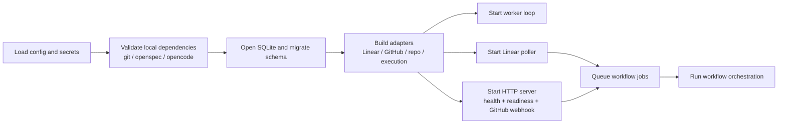

## Context

Heimdall now has durable product and service specifications, but the repository still lacks a runnable Go application. This bootstrap change creates the first executable service slice that can exercise the documented Linux-hosted workflow: poll Linear, reconcile repository state, create an OpenSpec proposal branch and pull request, accept PR command requests, and persist enough state and observability data to operate the service safely.

The main constraints are already fixed by the docs and specs:

- v1 is a single binary on a single Linux host
- Linear activation is polling-based, not webhook-based
- GitHub access uses a GitHub App plus inbound GitHub webhooks
- OpenSpec and OpenCode run locally through CLI wrappers
- SQLite is the only required persistent store in v1
- behavior coverage must be written in Gherkin and executable from the Go codebase

## Goals / Non-Goals

**Goals:**
- establish the first `go.mod`, application entrypoint, package structure, and canonical developer commands
- implement the core runtime loop: config, startup validation, SQLite, worker queue, poller, and HTTP webhook server
- implement the first end-to-end proposal workflow from Linear activation through branch creation, OpenSpec proposal generation, commit, push, and pull request creation
- implement safe PR command intake for status, refine, and apply workflows with authorization and deduplication
- add the initial SQLite schema, migrations, and persistence layer that match the documented runtime-state design
- add a Go-compatible Gherkin behavior-test harness and the first executable scenarios for critical bootstrap flows

**Non-Goals:**
- multi-tenant deployment, distributed workers, or a custom web UI
- Jira or additional SCM providers in this bootstrap change
- replacing local CLI execution with a remote execution service
- production-hardening every future workflow surface such as full archive automation, advanced reconciliation, or horizontal scaling

## Decisions

### Decision: Build a single binary with three runtime lanes

Heimdall will run one process containing:

- a Linear polling lane
- an HTTP lane for GitHub webhooks and health endpoints
- a worker lane for long-running workflow execution

Why:
- it matches the single-host operating model
- it avoids cross-process coordination before the state model is proven
- it still allows long-running work to be decoupled from webhook request latency

Alternatives considered:
- separate processes for poller, webhook server, and worker were rejected because they add more operational surface before the first service slice exists
- doing long-running mutation work directly in webhook handlers was rejected because it makes retries, timeouts, and command deduplication harder to manage safely

### Decision: Use SQLite plus startup migrations as the only runtime store

The bootstrap implementation will use SQLite for runtime state and will create or migrate the schema during startup before the service reports readiness.

Why:
- it matches the documented operator-simplicity preference
- it preserves durable state across restarts without requiring Postgres or another service
- it gives the worker queue, idempotency model, bindings, and audit trail a single local source of truth

Alternatives considered:
- an in-memory queue plus filesystem metadata was rejected because it makes recovery and reconciliation brittle
- Postgres was rejected for v1 because it increases install and support complexity without enabling the single-host scenario materially better than SQLite

### Decision: Use explicit provider and execution adapters from day one

The bootstrap service will keep these boundaries explicit:

- `board/linear` for polling and normalization
- `scm/github` for GitHub App auth, webhook verification, repo/PR/comment operations
- `repo` for local bare mirrors and worktrees
- `exec/openspec` and `exec/opencode` for local CLI wrappers
- `store` for SQLite-backed runtime state
- `workflow` for provider-neutral orchestration

Why:
- it matches the durable service specs already written for Heimdall
- it limits provider leakage into the core workflow engine
- it keeps the future Jira and remote-execution path open without overengineering the first implementation

Alternatives considered:
- collapsing everything into one large orchestration package was rejected because it would make later provider expansion expensive and hard to test

### Decision: Reuse a bare-mirror plus worktree repository strategy

The bootstrap implementation will follow the documented repository model:

- maintain a bare mirror per configured repository
- create one worktree per active workflow binding or run
- perform OpenSpec/OpenCode mutations inside the worktree

Why:
- it isolates workflow runs safely
- it avoids full fresh clones for every action
- it supports recoverable local execution for proposal, refine, and apply

Alternatives considered:
- cloning a fresh repository per job was rejected because it is slower and wastes network and disk on a service expected to revisit the same repositories

### Decision: Use local CLI wrappers with startup validation

The bootstrap service will wrap `git`, `openspec`, and `opencode` behind small execution adapters and validate that those executables are available before readiness succeeds.

Why:
- the docs and durable specs already choose local CLI execution for v1
- startup validation turns a common operator mistake into a fast, visible failure
- recording command/version metadata supports auditability and troubleshooting

Alternatives considered:
- deferring CLI failures until the first workflow run was rejected because it creates confusing delayed failures after the service already appears healthy

### Decision: Use GitHub `issue_comment` and `pull_request` webhooks only for the first command surface

The bootstrap service will implement webhook verification and parsing for the minimum event set already described in the docs:

- `issue_comment` for PR slash-command intake
- `pull_request` for pull request lifecycle synchronization and reconciliation hooks

Why:
- it is the smallest event surface that still supports proposal feedback and command workflows
- it keeps the command parser narrow and auditable

Alternatives considered:
- broader event subscriptions were rejected because they increase ingestion surface without helping the first service slice materially

### Decision: Use a Go-compatible Gherkin runner for behavior coverage

The bootstrap test harness will use Gherkin `.feature` files bound into the Go test suite with a Go-compatible BDD runner such as `godog`.

Why:
- the project is Go-first, so the behavior harness should live with the Go codebase
- Gherkin scenarios can cover the operator-visible workflows already described in the docs and durable specs
- using a Go-native runner avoids a split-brain test stack where behavior tests live in another language ecosystem

Alternatives considered:
- `pytest-bdd` was rejected for bootstrap because it would introduce a second language runtime as the primary behavior harness for a Go service
- relying only on unit tests was rejected because the critical workflows are operator-visible integrations that benefit from executable scenario coverage

## Risks / Trade-offs

- [Bootstrap scope is broad] -> Mitigation: structure tasks into vertical slices, get the propose path working first, and keep the initial command surface narrow.
- [External systems can make tests flaky] -> Mitigation: separate fast adapter and workflow tests from a smaller set of higher-level behavior tests with controlled fakes and fixtures.
- [Local CLI version drift can break workflows] -> Mitigation: validate required executables at startup, record versions in workflow step metadata, and document supported installation paths.
- [Polling and webhook redelivery can create duplicate work] -> Mitigation: persist idempotency keys, repository bindings, command dedupe keys, and queued job lock keys in SQLite.
- [GitHub App and local git interactions are security-sensitive] -> Mitigation: use short-lived installation tokens, verify webhook signatures before parsing, and keep tokens out of logs and SQLite.

## Migration Plan

There is no existing application runtime to migrate, so bootstrap migration is additive:

1. create the Go module, package layout, and canonical local commands
2. implement startup validation, SQLite schema creation, and health/readiness endpoints
3. implement Linear polling, runtime-state persistence, and repository routing
4. implement GitHub App auth, repo manager, proposal generation, commit/push, and pull request creation
5. implement webhook verification, command intake, authorization, and the first refine/apply workflow path
6. add Gherkin feature files and bind them into automated Go test execution
7. deploy to a test Linux host and verify the full issue-to-PR path before wider use

Rollback is operational rather than migratory: stop the service, restore the previous binary and config, and recover the SQLite database from backup if schema or state issues require it.

## Open Questions

- Which exact Go libraries should back GitHub App auth and API access in the first implementation: the official GitHub client plus an installation-token helper, or thinner direct HTTP wrappers?
- Should the first implementation of `/opsx-apply` execute the full apply path immediately, or should bootstrap stop after safe end-to-end intake plus a minimal guarded execution path and leave deeper apply coverage for the next change?
