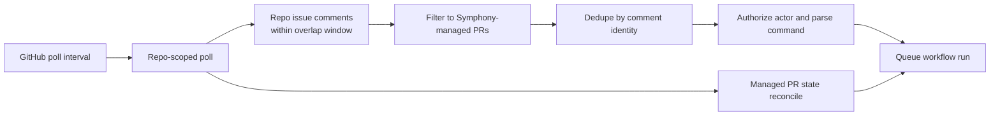

## Context

Symphony currently treats GitHub pull request command intake as a webhook problem. The existing repo reflects that assumption in operator docs, durable specs, config fields, webhook-specific environment variables, and code paths such as `internal/httpserver/webhook.go`, `internal/scm/github/client.go`, and the related BDD steps.

That conflicts with the desired v1 operating model for this change: one Linux host, no public GitHub webhook ingress, outbound-only API access, and the same operator-simplicity bias already used for Linear polling. The design therefore needs to replace inbound GitHub webhook handling with polling while preserving GitHub App auth, narrow command authorization, durable deduplication, and restart-safe reconciliation.

## Goals / Non-Goals

**Goals:**
- remove the standard v1 requirement for public GitHub webhook ingress
- detect new pull request command comments and relevant pull request state changes through GitHub App polling
- persist GitHub polling checkpoints and command dedupe state so polling remains safe across restarts and overlap windows
- keep the command surface, authorization rules, and Symphony-managed-PR restriction unchanged
- keep the design inside the current single-binary, SQLite-backed runtime model

**Non-Goals:**
- adding user OAuth or acting on behalf of GitHub end users
- scanning arbitrary repository history or all comments in every repository on every cycle
- removing local health or readiness endpoints if the service still wants them for private operations use
- changing the proposal, refine, or apply workflow semantics beyond how GitHub activity is discovered

## Decisions

### Decision: Replace webhook intake with a GitHub polling lane

Symphony will poll GitHub on a fixed interval using its GitHub App installation credentials instead of receiving inbound `issue_comment` and `pull_request` webhooks.

The poller should read:

- newly created issue comments that fall inside a configured overlap window
- relevant pull request state for Symphony-managed pull requests so lifecycle reconciliation still works

Why:
- it removes the public ingress requirement that the operator explicitly does not want
- it aligns GitHub intake with the existing polling-first v1 operating model
- it avoids webhook signing, delivery retries, and public endpoint hardening for the first deployment shape

Alternatives considered:
- keeping GitHub webhooks was rejected because it preserves the public ingress requirement
- polling GitHub's broader event feeds was rejected because they are less direct, less installation-focused, and harder to scope cleanly to managed pull request workflows

### Decision: Use repo-scoped polling with managed-PR filtering

The GitHub adapter should poll per managed repository, read repo-scoped issue comments within a `since` window, and then filter those comments down to Symphony-managed pull requests before command parsing.

Pull request lifecycle reconciliation should use the repository's known Symphony pull request bindings and fetch current pull request state for that narrow set.

Why:
- repo-scoped issue comment polling avoids an N+1 per-pull-request comment crawl
- filtering to Symphony-managed pull requests keeps API usage bounded and preserves the narrow mutation surface
- existing repository bindings already give Symphony the stable identifiers needed to relate GitHub activity back to internal workflow state

Alternatives considered:
- polling each managed pull request separately for comments was rejected because the call count grows too quickly as active pull requests increase
- polling all pull requests in the repository without filtering was rejected because it broadens the intake surface and wastes API budget on unrelated pull requests

### Decision: Persist GitHub polling checkpoints separately from command dedupe keys

Symphony should store both:

- a durable last-successful GitHub poll checkpoint per repository or equivalent scope
- durable command-request identities keyed by comment ID or node ID

The poller should read from `last_successful_poll - overlap_window`, process candidates, and only advance the checkpoint after a successful cycle.

Why:
- overlap windows reduce the chance of missed comments when clocks drift or a poll cycle partially fails
- durable comment-identity dedupe prevents the overlap window from re-running the same mutation command
- separating the checkpoint from the command identity keeps recovery logic simpler and easier to reason about

Alternatives considered:
- advancing the cursor before processing was rejected because mid-cycle failures could permanently skip commands
- deduping by timestamp alone was rejected because GitHub timestamps are not a safe uniqueness boundary for mutation workflows

### Decision: Remove webhook-specific operator requirements from the default deployment path

The standard v1 configuration and setup path should remove GitHub webhook-specific requirements such as `webhook_path` and `SYMPHONY_GITHUB_WEBHOOK_SECRET`, replacing them with polling-oriented configuration such as a poll interval and overlap window.

If the process continues to expose HTTP endpoints, they should be treated as private health and readiness endpoints rather than public GitHub ingestion endpoints.

Why:
- operator docs must match the intended deployment path
- removing unused webhook settings reduces setup confusion and secret sprawl
- preserving optional private health endpoints keeps operational debugging simple without reintroducing public ingress requirements

Alternatives considered:
- keeping webhook config as a required no-op was rejected because it leaves operators guessing which settings still matter
- removing the HTTP server entirely was rejected because health and readiness endpoints can still be useful on a private interface

## Risks / Trade-offs

- [Polling increases command latency] -> Mitigation: default to a short interval such as `30s` and document the latency trade-off clearly.
- [GitHub API rate limits become a runtime constraint] -> Mitigation: scope polling to managed repositories and managed pull requests, use overlap windows instead of oversized full scans, and back off on rate-limit responses.
- [A bad cursor update could skip commands] -> Mitigation: advance only after successful poll cycles and dedupe by stable comment identity.
- [Repo-wide comment polling may still surface unrelated comments] -> Mitigation: filter strictly to Symphony-managed pull requests before authorization or command parsing.
- [Migration touches multiple layers at once] -> Mitigation: change config, adapter logic, BDD scenarios, and docs together rather than leaving mixed webhook and polling semantics in the same release.

## Migration Plan

1. Add polling-oriented GitHub config fields and remove webhook-specific settings from the default operator path.
2. Replace webhook parsing and signature-verification paths with GitHub polling and managed pull request reconciliation paths.
3. Add or update SQLite-backed state for GitHub polling checkpoints and reuse durable command-request dedupe keys.
4. Update behavior tests so GitHub command intake is exercised through polling scenarios instead of webhook deliveries.
5. Update docs and setup guides so operators disable GitHub App webhooks and configure polling instead.
6. Deploy the new build without a public GitHub webhook endpoint and verify end-to-end command detection on a Symphony-managed pull request.

Rollback is operational: restore the previous webhook-based build and config if needed, or pause GitHub command intake until a corrected polling build is deployed.

## Open Questions

- Should the GitHub poller fetch repo-scoped issue comments from every managed repository on every cycle, or should it dynamically skip repositories with no active Symphony pull request bindings?
- Should pull request lifecycle reconciliation run on the same interval as comment polling, or on a separate slower interval to reduce API volume?
