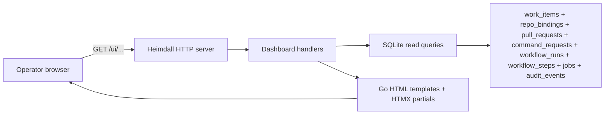

## Context

Heimdall's current operator surface is intentionally small: health checks, readiness checks, host logs, and GitHub/Linear themselves. That keeps v1 simple, but once SQLite is populated it also means operators must manually correlate `work_items`, `repo_bindings`, `pull_requests`, `command_requests`, `workflow_runs`, `workflow_steps`, `jobs`, and `audit_events` to answer basic questions like "what is queued right now?" or "what happened on this automation PR?"

This change adds a private read-only dashboard inside the same Go HTTP server rather than introducing a separate frontend service. That keeps the product centered on Linear and GitHub for workflow control while still giving the operator a faster local view into Heimdall's durable runtime state.

The current schema is already rich enough for the requested views, but it does not store arbitrary GitHub review-comment bodies. The dashboard therefore needs to present Heimdall-tracked PR activity from `command_requests`, `workflow_runs`, `workflow_steps`, `jobs`, and `audit_events`, and clearly frame that timeline as Heimdall's observed command/activity history.

## Goals / Non-Goals

**Goals:**
- Serve the operator UI from the existing Heimdall Go binary and HTTP server.
- Provide an overview screen, a work-item queue screen, and pull-request list/detail screens that make current system state understandable without direct SQL inspection.
- Show all tracked Linear work-item statuses and lifecycle buckets, including repository-binding and recent workflow context.
- Show active Heimdall-managed pull requests and a useful PR detail timeline built from Heimdall-tracked command, workflow, job, and audit records.
- Use server-rendered HTML plus HTMX fragment updates for filters, drill-downs, and refresh interactions.
- Keep the UI read-only and safe for a single-host private operator deployment.

**Non-Goals:**
- Replacing Linear or GitHub as the main workflow-control surface.
- Adding mutation actions such as rerun, apply, close PR, or comment posting from the dashboard.
- Introducing a separate SPA, frontend build pipeline, or second deployment artifact.
- Mirroring every GitHub review comment body into SQLite for v1.
- Building a multi-user or Internet-facing admin portal.

## Decisions

### Decision: Embed the dashboard in the existing HTTP server with server-rendered HTML and HTMX
The dashboard will be implemented as ordinary Go HTTP handlers that render HTML templates, with HTMX used for partial table refreshes, filter changes, and detail-panel swaps.

Rationale:
- matches the user's request to keep the UI inside the same Go application
- keeps the deployment as one binary with no separate frontend toolchain
- fits the operator-focused, mostly read-only interaction model

Alternatives considered:
- Separate SPA plus JSON API. Rejected because it adds frontend build/runtime complexity that the project explicitly wants to avoid in v1.
- Full page reloads only. Rejected because queue filtering and PR drill-downs would feel unnecessarily clumsy for a dashboard.

### Decision: Keep the dashboard private and read-only on the existing operator HTTP surface
The new UI will live on the same private operator surface as health and readiness endpoints. It will not expose repository mutation controls, and it will rely on the existing single-host/private-network deployment boundary rather than introducing a new multi-user application auth system in this change.

Rationale:
- stays aligned with the single-user Linux-host model
- avoids expanding Heimdall into a workflow-control web product
- reduces security risk by keeping the surface observational only

Alternatives considered:
- Add in-app user accounts and sessions. Rejected because it is out of scope for v1 and disproportionate for a private operator tool.
- Publish the dashboard as a public unauthenticated endpoint. Rejected because the data is operationally sensitive even if it excludes secrets.

### Decision: Build the dashboard from SQLite-first read models and label PR history as Heimdall-tracked activity
Handlers will query SQLite directly through small dashboard-focused read services. The work-item screen will read from `work_items` and enrich rows with `repo_bindings` and recent `workflow_runs`. The pull-request screens will read from `pull_requests`, `repo_bindings`, `work_items`, `command_requests`, `workflow_runs`, `workflow_steps`, `jobs`, and `audit_events`.

The PR detail timeline will present Heimdall-tracked command/activity history, not a full mirror of all GitHub review discussion, because the current durable schema stores command metadata and resulting workflow/audit state rather than arbitrary PR comment bodies.

Rationale:
- uses the schema the repo already defines instead of inventing a second state store
- keeps provider-specific fetch behavior out of the first dashboard slice
- gives operators a consistent, durable view even when external APIs are temporarily unavailable

Alternatives considered:
- Query GitHub live for every PR detail page. Rejected for v1 because it couples the dashboard to remote API availability and weakens the value of Heimdall's durable runtime state.
- Add a new generic PR-comments mirror table immediately. Rejected because the requested screens can be useful with the current model and a broader comment-ingestion design would need separate scoping.

### Decision: Ship three primary screens with HTMX drill-downs
The dashboard will expose three primary operator screens:

1. **Overview**: summary cards for work-item counts by lifecycle bucket/status, active PR count, running/failed workflow count, and queued/retryable job count, plus links into detailed screens.
2. **Work Items**: filterable queue/table for all tracked Linear work items with state, lifecycle bucket, team, last update, binding status, branch/change, and latest run status.
3. **Pull Requests**: active PR table plus a PR detail page or side panel that shows bound work item data, branch/change identity, command history, recent run/step state, and audit timeline.

Rationale:
- gives operators a fast top-level snapshot plus the two user-requested detailed views
- maps cleanly to the current schema relationships
- keeps the first UI slice focused instead of attempting to expose every table as a separate page

Alternatives considered:
- Start with only one giant dashboard page. Rejected because PR timelines and queue exploration need deeper space than a single page summary can provide.
- Expose separate pages for every database table. Rejected because it would leak storage structure instead of presenting useful operator workflows.

### Decision: Use explicit query seams and deterministic fragment endpoints
The implementation should introduce small read-side interfaces or packages near the HTTP handlers for dashboard queries, plus deterministic routes for full-page and fragment rendering such as `/ui`, `/ui/work-items`, `/ui/pull-requests`, `/ui/pull-requests/{id}`, and fragment endpoints for table bodies or detail sections.

Rationale:
- keeps the HTTP layer thin and testable
- preserves future room for pagination, alternate storage backends, or richer provider support
- makes HTMX interactions easy to reason about and verify

Alternatives considered:
- Embed SQL directly in handlers. Rejected because the joins and filters will grow beyond a maintainable inline shape.
- Introduce a generic repository abstraction just for the dashboard. Rejected because narrow query services are simpler and more idiomatic for this codebase.

## Risks / Trade-offs

- Operators may expect a full GitHub comment mirror from the PR detail view → Mitigation: label the timeline as Heimdall-tracked command/activity history and link to the canonical GitHub PR.
- Additional SQLite joins can become slow as history grows → Mitigation: start with bounded default result sizes, straightforward filters, and indexes added only where query profiling shows need.
- A private dashboard without in-app auth depends on deployment boundaries → Mitigation: keep the UI read-only, document the private-listen expectation, and avoid exposing secrets or raw payloads.
- HTMX introduces a small frontend dependency into an otherwise backend-heavy codebase → Mitigation: keep interactions limited to progressive enhancement over server-rendered HTML.

## Migration Plan

1. Extend the HTTP server with dashboard routes and shared layout/template plumbing.
2. Add dashboard read-query services over SQLite for overview counts, work-item queue rows, active PR rows, and PR activity timelines.
3. Implement the overview, work-item, and pull-request screens with HTMX fragment endpoints for filtering and detail refresh.
4. Update docs to describe the new private operator dashboard surface and its deployment/privacy expectations.
5. Add handler/query tests and behavior coverage for the observable dashboard flows.

Rollback is straightforward: remove the dashboard routes, templates, and query services. This change does not require destructive database migration if it stays on the current schema.

## Open Questions

None.
