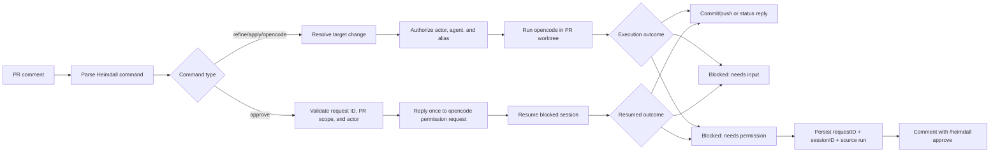

## Context

Heimdall already has durable workflow expectations for PR-comment refinement and apply, but the current command surface is uneven: `/heimdall refine` assumes the repository default agent, `/opsx-apply` is the only explicit agent-selected mutation path, and there is no defined path for safe generic opencode command execution from a pull request comment. The earlier version of this change also treated permission requests from `opencode` as terminal blockers, which is too limiting for real implementation work where an authorized reviewer may need to approve one specific pending request.

That gap matters now because this change is meant to unblock the real PR-comment implementation. GitHub comments are untrusted input, Heimdall is polling-based, and the service runs as a non-interactive background process on a single Linux host. The design therefore needs a command grammar, repository policy model, pending-permission state model, and approval flow that can be implemented deterministically without turning a pull request into an open-ended interactive shell.

Early implementation also exposed three additional contract holes in the earlier design: the parser could discard multiline prompt text that followed a trailing `--` command line, the workflow could let `/heimdall refine` reach execution with an empty target change while still reporting success through a stubbed execution path, and accepted queued PR commands could sit silently until later duplicate poll observations appeared because worker startup and terminal outcomes were not defined tightly enough. Runtime debugging then exposed another layer of adapter bugs: Heimdall can call `opencode run` with unsupported prompt flags, heuristic output matching can mistake CLI help text for a permission request, stale repo bindings can point at change names that no longer exist in the worktree, successful jobs can stay `running` and block later same-PR commands, and the approval path can claim to have resumed work without using the supported permission-reply API or observing the resumed session's actual result. The design now needs to make prompt preservation, supported opencode invocation, machine-readable blocked-state detection, worktree validation, queue completion, and truthful approval outcomes explicit so those failures are no longer treated as implementation interpretation details.

## Goals / Non-Goals

**Goals:**
- define a consistent `/heimdall` PR-comment grammar for agent-driven refine, apply, generic opencode execution, and explicit permission-request approval
- keep `/opsx-apply` working as a compatibility alias while making `/heimdall apply` the Heimdall-native form
- require explicit repository-allowed agents for agent-driven PR-comment execution instead of silently falling back to defaults
- keep generic opencode execution narrow by routing it through repository-allowed aliases rather than raw arbitrary command strings
- make `opencode` execution deterministic in a background service by turning clarification requests into blocked outcomes and permission requests into explicitly approved resumable outcomes
- require PR-comment refine/apply execution to use the real opencode invocation contract and machine-readable event streams instead of human-readable keyword heuristics
- preserve multiline prompt text exactly enough for agent-driven commands to consume the full body after the first standalone `--`
- guarantee that refine, apply, and generic opencode commands never start execution with an unresolved or empty change name
- guarantee that a resolved change still exists in the active worktree before agent-driven execution starts
- require `/heimdall refine` to use a real execution path rather than a placeholder success comment
- keep successful queued jobs and command requests in aligned terminal states so same-PR follow-up commands do not remain blocked by stale `running` locks

**Non-Goals:**
- allowing arbitrary shell access or raw opencode CLI flag pass-through from GitHub comments
- supporting free-form reply comments as approvals instead of a specific request-ID command
- auto-approving requested permissions or persisting blanket "always allow" approvals from pull request comments
- changing activation-triggered proposal generation away from the repository default spec-writing agent
- moving commit or push authority into opencode; Heimdall still owns git mutation publication around command execution

## Decisions

### Decision: Start one PR-command worker loop in normal app runtime

Heimdall will treat the PR-command worker as a first-class runtime responsibility, started alongside Linear polling and GitHub polling. The worker loop will repeatedly dequeue PR-command jobs, execute one job at a time under the existing queue locking rules, and keep running for the lifetime of the process.

Why:
- this closes the gap between successful command intake and actual command execution
- it keeps PR-command execution asynchronous, which matches the existing queue design and keeps polling fast
- it preserves the single-binary, single-host deployment model

Alternatives considered:
- execute PR commands inline during GitHub polling: rejected because repo mutation and CLI execution can make poll cycles slow and unpredictable
- start a worker only on demand after enqueue: rejected because a background loop is simpler and fits the existing persistent queue

### Decision: The worker must own the full queued PR-command surface

Every supported queued PR command must have a concrete worker dispatch path: `/heimdall status`, `/heimdall refine`, `/heimdall apply`, `/opsx-apply` (as apply), `/heimdall opencode`, and `/heimdall approve`. A supported command must not be left permanently queued or fail as an unknown job type because the worker surface is narrower than the parser/intake surface.

Why:
- the user-facing contract is defined by the documented PR commands, not by partial worker coverage
- `/heimdall status` is especially important because it is often the operator's first diagnostic command
- one dispatch surface keeps command-state handling, retries, and PR feedback consistent

Alternatives considered:
- keep status as a special inline path while other commands use the worker: rejected because it creates two different execution contracts for the same PR-command feature
- only require worker support for mutation commands: rejected because status must still produce a deterministic PR reply once accepted

### Decision: Worker lookups must use durable database identifiers

The worker must load command requests, pull requests, and repositories by the persisted IDs stored on the queued job or related records, rather than reconstructing lookup keys from command-request IDs, placeholder PR numbers, or other derived values.

Why:
- the queue already stores durable identifiers, so using them is the most deterministic and least error-prone path
- ID-based loading avoids silent mismatches between dedupe keys, comment node IDs, PR database IDs, repository IDs, and provider PR numbers
- it makes worker failures easier to reason about and test

Alternatives considered:
- reconstruct dedupe keys from queued job data: rejected because it couples worker loading to comment-identity formats and fails when the job only stores row IDs
- reload PRs by provider number without repository context: rejected because it weakens correctness and does not match the stored foreign-key relationships

### Decision: Use one structured command grammar for PR-comment execution and one explicit approval command

Heimdall will treat the PR-comment commands as structured subcommands with these shapes:

- `/heimdall refine [change-name] --agent <agent-name> -- <prompt>`
- `/heimdall apply [change-name] --agent <agent-name> [-- <prompt>]`
- `/opsx-apply [change-name] --agent <agent-name> [-- <prompt>]` as a compatibility alias for `/heimdall apply`
- `/heimdall opencode <command-alias> [change-name] --agent <agent-name> [-- <prompt>]`
- `/heimdall approve <permission-request-id>`

Parser rules:

- `--agent` is required for `refine`, `apply`, and `opencode`
- text after the first standalone `--` becomes the raw prompt tail passed into the execution request, even when the command line ends with `--` and the prompt continues on subsequent lines
- the raw prompt tail preserves later lines and list formatting instead of truncating the command at the first newline
- `change-name` may be omitted only when the pull request resolves to exactly one active OpenSpec change
- `/heimdall approve` does not take an agent, prompt tail, or change name; it operates on a previously reported permission request ID
- `/heimdall status` remains unchanged and does not require an agent

Why:
- the shared grammar makes the comment parser predictable and keeps examples easy to learn
- the `--` separator avoids brittle quote parsing in GitHub comments while still allowing freeform prompt text
- preserving everything after the first standalone `--` keeps multiline GitHub comment bodies usable for real refinement/apply prompts instead of silently dropping later lines
- an explicit approval command is auditable and machine-parseable in a way that reply comments are not

Alternatives considered:
- keep `/heimdall refine` on the repository default agent: rejected because this change specifically needs explicit per-run agent selection for manual PR-comment execution
- allow freeform trailing prompt text without a separator: rejected because optional change names and aliases make the parse ambiguous
- stop parsing at the first newline after the command line: rejected because it silently loses valid prompt content from normal multiline GitHub comments
- use a nested command such as `/heimdall permission approve <id>`: rejected because it adds parser complexity without adding safety in v1
- approve by replying conversationally to the blocker comment: rejected because it is too ambiguous to authorize safely

### Decision: Make generic opencode execution alias-based and repository-scoped

`/heimdall opencode` will not accept raw arbitrary opencode command strings from GitHub comments. Instead, each managed repository may define a small set of allowed command aliases.

Proposed dotenv shape:

- `HEIMDALL_REPO_<ID>_ALLOWED_AGENTS=<comma-separated agents>`
- `HEIMDALL_REPO_<ID>_OPENCODE_COMMANDS=<comma-separated aliases>`
- `HEIMDALL_REPO_<ID>_OPENCODE_COMMAND_<ALIAS>_COMMAND=<opencode-command-name>`
- `HEIMDALL_REPO_<ID>_OPENCODE_COMMAND_<ALIAS>_PERMISSION_PROFILE=<readonly|openspec-write|repo-write>`

Example:

- `HEIMDALL_REPO_PLATFORM_OPENCODE_COMMANDS=explore-change`
- `HEIMDALL_REPO_PLATFORM_OPENCODE_COMMAND_EXPLORE_CHANGE_COMMAND=opsx-explore`
- `HEIMDALL_REPO_PLATFORM_OPENCODE_COMMAND_EXPLORE_CHANGE_PERMISSION_PROFILE=readonly`

Why:
- an alias model keeps the GitHub comment surface narrow and auditable
- repository-scoped configuration lets operators choose which helper commands are safe in that repo
- it avoids turning PR comments into a generic remote execution tunnel

Alternatives considered:
- allow raw opencode slash commands from comments: rejected because it is too broad for the current trust model
- hardcode one global alias list in the binary: rejected because repositories may want different command surfaces and permission envelopes

### Decision: Build typed execution and approval requests with fixed permission profiles

After parsing, Heimdall will convert comment commands into typed requests.

Agent-driven execution requests include:

- command kind (`refine`, `apply`, `opencode`)
- resolved change name
- selected agent
- optional prompt tail
- repository worktree path
- optional generic command alias and resolved opencode command name
- permission profile

Approval requests include:

- command kind (`approve`)
- permission request ID
- pull request ID and repository binding
- requesting actor

Permission profiles are policy objects chosen by Heimdall, not ad hoc approvals typed by the commenter:

- `openspec-write` for `/heimdall refine`
- `repo-write` for `/heimdall apply` and `/opsx-apply`
- alias-configured profile for `/heimdall opencode`

These profiles define the maximum tool/permission envelope Heimdall is willing to let the opencode run use before an additional explicit approval is required. Heimdall still owns post-run git commit, push, and PR feedback, so the execution profile does not grant remote-publish authority to opencode.

Why:
- typed requests keep the workflow engine provider-neutral while putting opencode-specific policy in the execution adapter
- fixed profiles make permission behavior deterministic and testable
- approval commands can be authorized separately from agent-driven execution while still using the same PR-command pipeline

Alternatives considered:
- pass raw CLI arguments from the comment into opencode: rejected because it weakens parsing safety and policy enforcement
- let each command dynamically request any permission and wait on stdin: rejected because the service is not an interactive terminal session

### Decision: Use supported opencode invocation forms and machine-readable event parsing

Heimdall will treat the opencode adapter contract as part of the durable workflow behavior, not as a replaceable implementation detail. For refine and apply runs, Heimdall must invoke `opencode run` by using the CLI-supported positional message form (or an equivalent supported SDK call), and when the CLI path is used it must request machine-readable JSON events rather than depending on free-form formatted output.

Blocked-input, blocked-permission, resumed, and terminal error outcomes must be derived from structured runtime events. Heimdall must not classify a generic stderr/stdout string as `needs_permission` merely because the text contains words like `permission` or `permissions`.

Why:
- the real CLI contract does not accept arbitrary prompt flags in all environments, so relying on unsupported flags can turn valid runs into usage text
- machine-readable events expose stable session and permission identifiers while human-readable help text does not
- structured parsing is the only reliable way to distinguish an actual permission request from a plain command-line usage failure

Alternatives considered:
- keep heuristic substring parsing of formatted output: rejected because help text and generic errors can mention permissions without representing a pending request
- treat the CLI invocation shape as implementation-specific: rejected because a mismatched invocation contract is itself a user-visible workflow failure

### Decision: Permission blockers must come only from explicit permission events with usable IDs

Heimdall will create or comment on a pending permission request only when the execution adapter sees an explicit machine-readable permission event, such as `permission.asked`, that includes a non-empty request ID and session ID. If those identifiers are missing, Heimdall must fail the command visibly instead of persisting a blank pending-request row or publishing an approval command with an empty request token.

Why:
- `/heimdall approve <request-id>` is only safe when the reported ID is real, exact, and scoped to the same blocked session
- blank or synthetic permission IDs create approval commands that cannot work and mislead operators into thinking approval is available
- a failing command is easier to diagnose than a fake blocked state that can never be resolved

Alternatives considered:
- synthesize a request ID from local state when the adapter cannot extract one: rejected because it would not map to a real opencode approval target
- persist pending permission rows with empty IDs and hope a later retry fills them in: rejected because it makes the approval contract nondeterministic

### Decision: Persist pending permission requests as durable PR-scoped state

When `opencode` requests a permission outside the selected profile, Heimdall will persist a pending permission-request record that includes at least:

- the opencode permission request ID
- the opencode session ID or equivalent resume handle
- the originating command request and workflow run
- the repository and pull request binding
- the blocked status and timestamps

The PR feedback for a blocked permission request must include the exact request ID and the exact approval command to run next.

Why:
- approval commands may arrive in a later poll cycle or after a service restart
- the request ID must stay bound to the correct pull request and blocked run so Heimdall cannot approve an unrelated session accidentally
- durable state lets Heimdall reject duplicate or stale approvals deterministically

Alternatives considered:
- keep permission requests in memory only: rejected because polling cycles and restarts would lose the ability to approve safely
- force users to rerun the original command every time a permission is needed: rejected because the user explicitly wants approval by request ID

### Decision: Validate the resolved OpenSpec change against the current worktree before execution

Resolving a single target change from repo bindings is necessary but not sufficient. Before refine, apply, or generic opencode execution starts, Heimdall must verify that the resolved change actually exists in the active worktree that will be used for the run. If the repo binding points at a change name that no longer exists in the worktree, Heimdall must reject the command as a stale binding instead of sending an invalid change target into opencode.

Why:
- repo bindings can outlive the actual worktree contents and otherwise create confusing execution failures later in the adapter
- rejecting stale bindings early gives operators a clearer repair path than allowing an execution adapter to fail deep inside the run
- the PR comment contract is about mutating real OpenSpec changes, not just names that once existed in runtime state

Alternatives considered:
- trust runtime bindings without checking the worktree: rejected because stale bindings have already produced misleading execution flows in practice
- let opencode discover missing changes indirectly: rejected because the resulting error is less targeted and easier to misclassify

### Decision: Clarification requests remain blocked, but permission requests become blocked-and-resumable

Heimdall will not use interactive stdin approval loops.

- if `opencode` asks for clarification input, Heimdall marks the run as `needs_input`, comments with retry guidance, and treats that attempt as terminally blocked
- if `opencode` asks for an additional permission through an explicit machine-readable permission event, Heimdall marks the run as `needs_permission`, persists the exact pending permission request and session identifiers, comments with that exact request ID, and waits for an explicit approval command
- if the adapter only encounters CLI help, usage output, or another generic execution error, Heimdall treats that result as a normal failed execution and does not publish an approval command

Why:
- clarification is not safely answerable through an implicit machine action
- permission approval can be safely narrowed to one persisted request ID and one one-time reply
- this keeps the service deterministic without turning it into a general-purpose chat relay

Alternatives considered:
- auto-approve requested permissions: rejected because GitHub comments are untrusted input and the operator wants explicit control over git-related access
- treat permission requests as terminal failures only: rejected because it prevents the narrow explicit approval flow the user wants

### Decision: Successful PR-command jobs must release their queue lock immediately

When a queued PR command finishes successfully, Heimdall must transition both the command request and the underlying queue job to a completed state. A successful job must not remain in `running`, because PR-command jobs share a pull-request lock key and a stale running job can block later same-PR commands even when the earlier command already posted a terminal outcome.

Why:
- the queue lock is part of the runtime safety model, so stale `running` rows directly affect later user-visible command execution
- aligned command and job terminal states make duplicate-poll logs easier to interpret and simplify recovery after restarts
- a completed command that still holds the PR lock violates operator expectations and can make `/heimdall approve` or later retries appear stuck

Alternatives considered:
- rely on command-request status alone and ignore the queue row: rejected because the queue uses the job's `running` state to enforce lock exclusion
- periodically clean up stale successful jobs later: rejected because same-PR follow-up commands need the lock released immediately

### Decision: Status replies run through the same command/job lifecycle as other PR commands

`/heimdall status` will remain a queued PR command, but the worker must execute it to completion and post one visible PR comment describing the current change binding or ambiguity state for that pull request. Duplicate later observations of the same GitHub comment remain deduped and must not produce additional replies.

Why:
- it preserves the existing intake/dedupe model while fixing the user-visible failure mode
- it gives operators a reliable way to confirm that Heimdall both saw and executed the command
- it keeps status behavior aligned with the rest of the PR-command feature set

Alternatives considered:
- convert status into a read-only synchronous polling-time reply: rejected because it would bypass the queue contract and make command execution behavior inconsistent

### Decision: `PRCommandExecutor` entry points must be real orchestration methods, not placeholders

The command executor methods that sit behind the worker-facing dispatch surface must each own the real work for their command kind:

- `ExecuteStatus` must load and summarize actual pull-request-bound change state, rather than returning a generic canned response unrelated to the current PR state
- `ExecuteRefine` must resolve the change, run the real non-interactive refine flow with the preserved prompt tail, handle blocked and no-change outcomes, and publish truthful PR feedback only after the run reaches a real outcome
- `ExecuteApply` must run the real apply flow, including change resolution, execution, commit/push behavior when changes are produced, and accurate PR feedback for success, blocked, no-change, or failed outcomes
- `ExecuteOpencode` must resolve the configured alias and target change, run the actual generic opencode command through the execution adapter, and publish the true result of that run instead of a placeholder completion comment
- `ExecuteApprove` must validate the pending request, send the one-time permission reply, resume the blocked session, update persisted request state only after the approval/resume path succeeds, and comment with the resumed outcome rather than only flipping a row status optimistically

These entry points may share helper functions, but the user-visible command lifecycle must not terminate in a placeholder success path once the worker reaches them.

Why:
- the current bug reports were able to produce apparently successful command logs even when the underlying command had not actually used the intended prompt, change target, or execution path
- keeping the real orchestration anchored at the executor entry points makes worker dispatch semantics and testing much clearer
- truthful outcomes are especially important for PR comments because operators use the pull-request feedback to decide what Heimdall actually did

Alternatives considered:
- leave executor methods as temporary success comments until later: rejected because it makes the command surface appear implemented when key behavior is still missing
- push all real execution into lower-level helpers while keeping executor methods thin pass-through shells with generic success replies: rejected because it weakens the boundary where command-specific correctness and feedback should be enforced

### Decision: `/heimdall approve <request-id>` approves once and only within the same PR scope

When Heimdall receives `/heimdall approve <permission-request-id>`, it will:

1. verify the commenter is authorized for PR-comment mutation workflows in that repository
2. verify the request ID exists, is still pending, and belongs to a blocked run on the same pull request
3. send a one-time approval reply to that exact opencode permission request by using the supported opencode permission-reply API
4. resume or allow the blocked opencode session to continue by observing the same persisted session identity
5. publish the resumed terminal outcome from that session back to the pull request

If the request ID is unknown, already resolved, expired, or belongs to a different pull request, Heimdall rejects the command and does not send any permission reply.

Why:
- one-time approval is the narrowest useful capability
- same-PR validation prevents a commenter from copying a request ID into another pull request to escalate access
- explicit rejection of stale or cross-scoped IDs gives operators understandable safety rails

Alternatives considered:
- permit `always` approvals from PR comments: rejected because persistent permission expansion should remain operator-configured, not comment-driven
- require the approver to be the same actor as the original requester: rejected because authorized collaborators may need to review and approve another engineer's blocked run

### Decision: Keep change resolution consistent across agent-driven commands and enforce it immediately before execution

All agent-driven PR-comment commands will resolve exactly one target OpenSpec change before execution starts. If the commenter omits `change-name`, Heimdall will infer it only when the bound pull request has exactly one active change. The approval command bypasses change resolution and instead targets one persisted permission request ID.

The worker may persist the original command request with an empty `change-name` field when the commenter omits it, but it must perform the actual single-change resolution immediately before execution and must not call refine, apply, or generic execution adapters with an empty resolved change. After resolution, Heimdall must also verify that the resolved change exists in the worktree it is about to mutate. Zero-target, multi-target, and stale-binding cases are rejected as terminal user-visible command outcomes rather than being allowed to fall through into a best-effort run.

Why:
- this keeps refine, apply, and generic execution aligned with the same deterministic change identity
- it avoids accidental edits against the wrong change when a branch or pull request contains more than one active change
- it prevents execution adapters and PR comments from claiming success for commands that never had a valid target change
- approval commands act on a blocked permission request, not on a new change-selection decision

Alternatives considered:
- always guess the most recently modified change: rejected because it is not deterministic enough for mutation workflows
- require `change-name` in every agent-driven command: rejected because the common single-change PR path should stay concise

### Decision: `/heimdall refine` must use a real prompt-preserving execution path

`/heimdall refine` will no longer be allowed to succeed through a placeholder PR comment. Instead, once Heimdall has resolved exactly one target change, it must run the real non-interactive refine path with the selected agent and the preserved raw prompt tail, then publish a result that reflects what actually happened.

That means the refine path must distinguish at least these outcomes:

- successful execution that produced artifact updates
- successful execution that produced no repository changes
- blocked execution that needs clarification input or permission approval
- failed execution caused by runtime or adapter errors

Why:
- a stubbed success path makes the PR feedback misleading and hides parser or execution bugs
- refine and apply should follow the same truthfulness standard for agent-driven command results
- preserving the raw multiline prompt body only matters if the real execution path actually consumes it

Alternatives considered:
- keep the placeholder refine success comment until later: rejected because it makes the command appear implemented when it is not
- collapse no-change, blocked, and failed outcomes into one generic success comment: rejected because operators need actionable PR feedback

### Decision: Command and job state must expose terminal outcomes clearly

The worker must move command/job records through clear states such as queued, running, completed, rejected, blocked, or failed/dead so operators can distinguish a healthy duplicate observation from a request that never executed. Retry behavior must remain explicit and bounded rather than creating an invisible immediate loop.

Why:
- queued command execution is now a core part of the user-visible contract rather than an implementation detail
- clear state transitions improve dashboard visibility and debugging after restarts or worker errors
- bounded retry semantics match the single-host operational model better than silent tight retry loops

Alternatives considered:
- keep only job-level state and leave command requests as queued forever: rejected because the user-facing command object also needs a diagnosable terminal state

## Risks / Trade-offs

- [Long-lived pending permission requests add runtime-state complexity] -> Mitigation: persist request/session metadata explicitly and reject stale or duplicate approvals deterministically.
- [Comment-based approval can be mistaken for broad permission escalation] -> Mitigation: approval is one-time, request-ID-specific, and constrained to the same pull request.
- [The opencode CLI or SDK event schema may evolve over time] -> Mitigation: keep classification and reply logic centralized in the OpenCode adapter, test against machine-readable permission and session events explicitly, and fail visibly when required identifiers are missing.
- [Generic opencode support increases the remote execution surface] -> Mitigation: require repository-scoped aliases and fixed permission profiles instead of raw arbitrary commands.
- [Users may expect clarification questions to be answerable through the same approval flow] -> Mitigation: document that v1 supports explicit permission approval only; clarification still requires rerunning the original command with a better prompt.
- [Multiline prompt parsing can accidentally swallow unrelated text when the separator rules are too loose] -> Mitigation: anchor capture to the first standalone `--` and treat only the remainder of that comment as the raw prompt body.
- [Real refine execution may expose no-change cases that were previously hidden by the stub] -> Mitigation: define explicit no-change and blocked outcomes in PR feedback instead of treating them as silent success.
- [A started worker can turn latent worker-path bugs into active retries] -> Mitigation: require full worker coverage for the documented commands, durable-ID lookups, and explicit terminal state handling.
- [Unsupported opencode CLI arguments can degrade into misleading help text] -> Mitigation: require supported invocation forms and classify help/usage output as plain execution failures rather than permission blockers.
- [Stale running jobs can block later same-PR commands] -> Mitigation: require successful jobs to transition to `completed` immediately and keep queue/job state aligned with command-request state.
- [Status replies may expose confusing ambiguity information on multi-change PRs] -> Mitigation: require the status reply to summarize the current binding state explicitly instead of guessing one target change.
- [More explicit command/job state transitions add persistence complexity] -> Mitigation: keep the states narrow and aligned with existing queue semantics rather than inventing a new orchestration model.

## Migration Plan

1. Start the PR-command worker during normal service startup.
2. Extend PR comment parsing so Heimdall recognizes `/heimdall refine`, `/heimdall apply`, `/opsx-apply`, `/heimdall opencode`, and `/heimdall approve`, while preserving multiline prompt text after the first standalone `--`.
3. Add or extend repository and runtime-state parsing so Heimdall can store pending permission request/session metadata alongside parsed command requests.
4. Implement typed execution and approval requests in the workflow and execution adapters, including durable-ID worker lookups, supported opencode invocation shapes, machine-readable event parsing, change resolution immediately before agent-driven execution, and request-ID validation before approval replies.
5. Replace the placeholder refine-success path with real refine execution and truthful PR feedback for success, no-change, blocked, or failed outcomes.
6. Add blocked-result handling that comments with exact permission request IDs from real permission events, rejects missing identifiers or CLI help output as ordinary failures, and implements explicit approval replies plus resumed-session outcome reporting.
7. Update queue state handling so successful jobs complete and release their PR lock, then extend behavior tests, docs, and fixtures to cover worker startup, status replies, multiline prompt preservation, successful command execution, alias rejection, ambiguous or missing change targeting, stale change bindings, blocked clarification requests, blocked permission requests, false-permission regressions, and explicit permission approval.

Rollback is straightforward: disable or ignore the `/heimdall approve` path, keep the blocked-comment behavior for permission requests, and revert the persisted pending-permission state if needed.

## Open Questions

None blocking. Implementation should prefer native machine-readable pending-permission and reply APIs from `opencode` when available and otherwise keep any fallback session-handling logic confined to the OpenCode adapter.
