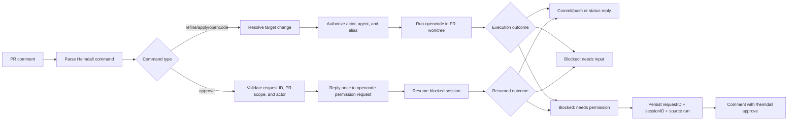

## Context

Heimdall already has durable workflow expectations for PR-comment refinement and apply, but the current command surface is uneven: `/heimdall refine` assumes the repository default agent, `/opsx-apply` is the only explicit agent-selected mutation path, and there is no defined path for safe generic opencode command execution from a pull request comment. The earlier version of this change also treated permission requests from `opencode` as terminal blockers, which is too limiting for real implementation work where an authorized reviewer may need to approve one specific pending request.

That gap matters now because this change is meant to unblock the real PR-comment implementation. GitHub comments are untrusted input, Heimdall is polling-based, and the service runs as a non-interactive background process on a single Linux host. The design therefore needs a command grammar, repository policy model, pending-permission state model, and approval flow that can be implemented deterministically without turning a pull request into an open-ended interactive shell.

## Goals / Non-Goals

**Goals:**
- define a consistent `/heimdall` PR-comment grammar for agent-driven refine, apply, generic opencode execution, and explicit permission-request approval
- keep `/opsx-apply` working as a compatibility alias while making `/heimdall apply` the Heimdall-native form
- require explicit repository-allowed agents for agent-driven PR-comment execution instead of silently falling back to defaults
- keep generic opencode execution narrow by routing it through repository-allowed aliases rather than raw arbitrary command strings
- make `opencode` execution deterministic in a background service by turning clarification requests into blocked outcomes and permission requests into explicitly approved resumable outcomes

**Non-Goals:**
- allowing arbitrary shell access or raw opencode CLI flag pass-through from GitHub comments
- supporting free-form reply comments as approvals instead of a specific request-ID command
- auto-approving requested permissions or persisting blanket "always allow" approvals from pull request comments
- changing activation-triggered proposal generation away from the repository default spec-writing agent
- moving commit or push authority into opencode; Heimdall still owns git mutation publication around command execution

## Decisions

### Decision: Use one structured command grammar for PR-comment execution and one explicit approval command

Heimdall will treat the PR-comment commands as structured subcommands with these shapes:

- `/heimdall refine [change-name] --agent <agent-name> -- <prompt>`
- `/heimdall apply [change-name] --agent <agent-name> [-- <prompt>]`
- `/opsx-apply [change-name] --agent <agent-name> [-- <prompt>]` as a compatibility alias for `/heimdall apply`
- `/heimdall opencode <command-alias> [change-name] --agent <agent-name> [-- <prompt>]`
- `/heimdall approve <permission-request-id>`

Parser rules:

- `--agent` is required for `refine`, `apply`, and `opencode`
- text after the first standalone `--` becomes the raw prompt tail passed into the execution request
- `change-name` may be omitted only when the pull request resolves to exactly one active OpenSpec change
- `/heimdall approve` does not take an agent, prompt tail, or change name; it operates on a previously reported permission request ID
- `/heimdall status` remains unchanged and does not require an agent

Why:
- the shared grammar makes the comment parser predictable and keeps examples easy to learn
- the `--` separator avoids brittle quote parsing in GitHub comments while still allowing freeform prompt text
- an explicit approval command is auditable and machine-parseable in a way that reply comments are not

Alternatives considered:
- keep `/heimdall refine` on the repository default agent: rejected because this change specifically needs explicit per-run agent selection for manual PR-comment execution
- allow freeform trailing prompt text without a separator: rejected because optional change names and aliases make the parse ambiguous
- use a nested command such as `/heimdall permission approve <id>`: rejected because it adds parser complexity without adding safety in v1
- approve by replying conversationally to the blocker comment: rejected because it is too ambiguous to authorize safely

### Decision: Make generic opencode execution alias-based and repository-scoped

`/heimdall opencode` will not accept raw arbitrary opencode command strings from GitHub comments. Instead, each managed repository may define a small set of allowed command aliases.

Proposed dotenv shape:

- `HEIMDALL_REPO_<ID>_ALLOWED_AGENTS=<comma-separated agents>`
- `HEIMDALL_REPO_<ID>_OPENCODE_COMMANDS=<comma-separated aliases>`
- `HEIMDALL_REPO_<ID>_OPENCODE_COMMAND_<ALIAS>_COMMAND=<opencode-command-name>`
- `HEIMDALL_REPO_<ID>_OPENCODE_COMMAND_<ALIAS>_PERMISSION_PROFILE=<readonly|openspec-write|repo-write>`

Example:

- `HEIMDALL_REPO_PLATFORM_OPENCODE_COMMANDS=explore-change`
- `HEIMDALL_REPO_PLATFORM_OPENCODE_COMMAND_EXPLORE_CHANGE_COMMAND=opsx-explore`
- `HEIMDALL_REPO_PLATFORM_OPENCODE_COMMAND_EXPLORE_CHANGE_PERMISSION_PROFILE=readonly`

Why:
- an alias model keeps the GitHub comment surface narrow and auditable
- repository-scoped configuration lets operators choose which helper commands are safe in that repo
- it avoids turning PR comments into a generic remote execution tunnel

Alternatives considered:
- allow raw opencode slash commands from comments: rejected because it is too broad for the current trust model
- hardcode one global alias list in the binary: rejected because repositories may want different command surfaces and permission envelopes

### Decision: Build typed execution and approval requests with fixed permission profiles

After parsing, Heimdall will convert comment commands into typed requests.

Agent-driven execution requests include:

- command kind (`refine`, `apply`, `opencode`)
- resolved change name
- selected agent
- optional prompt tail
- repository worktree path
- optional generic command alias and resolved opencode command name
- permission profile

Approval requests include:

- command kind (`approve`)
- permission request ID
- pull request ID and repository binding
- requesting actor

Permission profiles are policy objects chosen by Heimdall, not ad hoc approvals typed by the commenter:

- `openspec-write` for `/heimdall refine`
- `repo-write` for `/heimdall apply` and `/opsx-apply`
- alias-configured profile for `/heimdall opencode`

These profiles define the maximum tool/permission envelope Heimdall is willing to let the opencode run use before an additional explicit approval is required. Heimdall still owns post-run git commit, push, and PR feedback, so the execution profile does not grant remote-publish authority to opencode.

Why:
- typed requests keep the workflow engine provider-neutral while putting opencode-specific policy in the execution adapter
- fixed profiles make permission behavior deterministic and testable
- approval commands can be authorized separately from agent-driven execution while still using the same PR-command pipeline

Alternatives considered:
- pass raw CLI arguments from the comment into opencode: rejected because it weakens parsing safety and policy enforcement
- let each command dynamically request any permission and wait on stdin: rejected because the service is not an interactive terminal session

### Decision: Persist pending permission requests as durable PR-scoped state

When `opencode` requests a permission outside the selected profile, Heimdall will persist a pending permission-request record that includes at least:

- the opencode permission request ID
- the opencode session ID or equivalent resume handle
- the originating command request and workflow run
- the repository and pull request binding
- the blocked status and timestamps

The PR feedback for a blocked permission request must include the exact request ID and the exact approval command to run next.

Why:
- approval commands may arrive in a later poll cycle or after a service restart
- the request ID must stay bound to the correct pull request and blocked run so Heimdall cannot approve an unrelated session accidentally
- durable state lets Heimdall reject duplicate or stale approvals deterministically

Alternatives considered:
- keep permission requests in memory only: rejected because polling cycles and restarts would lose the ability to approve safely
- force users to rerun the original command every time a permission is needed: rejected because the user explicitly wants approval by request ID

### Decision: Clarification requests remain blocked, but permission requests become blocked-and-resumable

Heimdall will not use interactive stdin approval loops.

- if `opencode` asks for clarification input, Heimdall marks the run as `needs_input`, comments with retry guidance, and treats that attempt as terminally blocked
- if `opencode` asks for an additional permission, Heimdall marks the run as `needs_permission`, persists the pending permission request, comments with the request ID, and waits for an explicit approval command

Why:
- clarification is not safely answerable through an implicit machine action
- permission approval can be safely narrowed to one persisted request ID and one one-time reply
- this keeps the service deterministic without turning it into a general-purpose chat relay

Alternatives considered:
- auto-approve requested permissions: rejected because GitHub comments are untrusted input and the operator wants explicit control over git-related access
- treat permission requests as terminal failures only: rejected because it prevents the narrow explicit approval flow the user wants

### Decision: `/heimdall approve <request-id>` approves once and only within the same PR scope

When Heimdall receives `/heimdall approve <permission-request-id>`, it will:

1. verify the commenter is authorized for PR-comment mutation workflows in that repository
2. verify the request ID exists, is still pending, and belongs to a blocked run on the same pull request
3. send a one-time approval reply to that exact opencode permission request
4. resume or allow the blocked opencode session to continue
5. publish the resumed outcome back to the pull request

If the request ID is unknown, already resolved, expired, or belongs to a different pull request, Heimdall rejects the command and does not send any permission reply.

Why:
- one-time approval is the narrowest useful capability
- same-PR validation prevents a commenter from copying a request ID into another pull request to escalate access
- explicit rejection of stale or cross-scoped IDs gives operators understandable safety rails

Alternatives considered:
- permit `always` approvals from PR comments: rejected because persistent permission expansion should remain operator-configured, not comment-driven
- require the approver to be the same actor as the original requester: rejected because authorized collaborators may need to review and approve another engineer's blocked run

### Decision: Keep change resolution consistent across agent-driven commands only

All agent-driven PR-comment commands will resolve exactly one target OpenSpec change before execution starts. If the commenter omits `change-name`, Heimdall will infer it only when the bound pull request has exactly one active change. The approval command bypasses change resolution and instead targets one persisted permission request ID.

Why:
- this keeps refine, apply, and generic execution aligned with the same deterministic change identity
- it avoids accidental edits against the wrong change when a branch or pull request contains more than one active change
- approval commands act on a blocked permission request, not on a new change-selection decision

Alternatives considered:
- always guess the most recently modified change: rejected because it is not deterministic enough for mutation workflows
- require `change-name` in every agent-driven command: rejected because the common single-change PR path should stay concise

## Risks / Trade-offs

- [Long-lived pending permission requests add runtime-state complexity] -> Mitigation: persist request/session metadata explicitly and reject stale or duplicate approvals deterministically.
- [Comment-based approval can be mistaken for broad permission escalation] -> Mitigation: approval is one-time, request-ID-specific, and constrained to the same pull request.
- [The opencode CLI may not expose one perfect machine-readable signal for blocked input, blocked permissions, or session resumption] -> Mitigation: keep classification and reply logic centralized in the OpenCode adapter and prefer native machine-readable APIs when available.
- [Generic opencode support increases the remote execution surface] -> Mitigation: require repository-scoped aliases and fixed permission profiles instead of raw arbitrary commands.
- [Users may expect clarification questions to be answerable through the same approval flow] -> Mitigation: document that v1 supports explicit permission approval only; clarification still requires rerunning the original command with a better prompt.

## Migration Plan

1. Extend PR comment parsing so Heimdall recognizes `/heimdall refine`, `/heimdall apply`, `/opsx-apply`, `/heimdall opencode`, and `/heimdall approve`.
2. Add or extend repository and runtime-state parsing so Heimdall can store pending permission request/session metadata alongside parsed command requests.
3. Implement typed execution and approval requests in the workflow and execution adapters, including change resolution before opencode starts and request-ID validation before approval replies.
4. Add blocked-result handling that comments with permission request IDs, then implement explicit approval replies and resumed outcome reporting.
5. Update behavior tests, docs, and fixtures to cover successful command execution, alias rejection, ambiguous change targeting, blocked clarification requests, blocked permission requests, and explicit permission approval.

Rollback is straightforward: disable or ignore the `/heimdall approve` path, keep the blocked-comment behavior for permission requests, and revert the persisted pending-permission state if needed.

## Open Questions

None blocking. Implementation should prefer native machine-readable pending-permission and reply APIs from `opencode` when available and otherwise keep any fallback session-handling logic confined to the OpenCode adapter.
