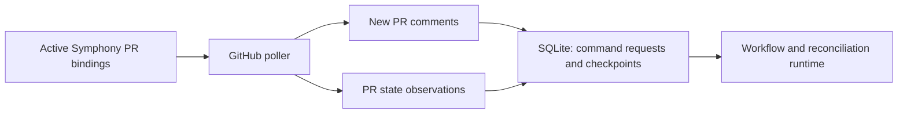

## Context

Symphony already treats GitHub polling as the v1 intake model, but the implementation change needs a concrete design for how a GitHub poller discovers new pull request comments and pull request state changes without any webhook dependency. The change crosses the GitHub adapter, runtime state storage, command intake flow, and operational visibility, so the design needs to pin down polling scope, checkpoint behavior, and restart semantics before implementation starts.

The implementation must stay inside the existing v1 constraints:

- single Linux-hosted binary
- GitHub App authentication with short-lived installation tokens
- SQLite for durable state and deduplication
- no public inbound endpoint requirement

## Goals / Non-Goals

**Goals:**

- Poll GitHub on `github.poll_interval` for newly created comments and pull request state changes relevant to Symphony-managed pull requests.
- Limit GitHub API traffic to installed, configured repositories and active Symphony pull request bindings rather than broad repository scans.
- Persist GitHub polling checkpoints and comment deduplication keys in SQLite so restarts do not replay old comments or lose lifecycle state.
- Feed discovered comments into the existing authorization and command parsing pipeline without requiring inbound webhooks.
- Expose enough logs and counters to debug lag, duplicate suppression, and poll failures.

**Non-Goals:**

- Adding GitHub webhooks or any public inbound HTTP receiver.
- Expanding command intake to arbitrary repository pull requests that Symphony does not manage.
- Supporting comment edits or review-comment commands in v1.
- Introducing distributed workers, external queues, or a database other than SQLite.

## Decisions

### Use a dedicated GitHub polling worker scoped by active PR bindings

The GitHub SCM adapter will own a poller that runs on `github.poll_interval`. Instead of scanning every pull request in every installed repository, the poller will read active Symphony pull request bindings from runtime state, group them by repository and installation, and poll only that scoped set.

Why this approach:

- it keeps GitHub-specific query behavior inside the SCM adapter
- it reduces API cost and rate-limit pressure
- it aligns the intake surface with pull requests Symphony is already allowed to mutate

Alternative considered:

- scanning all open repository pull requests would be simpler at first, but it would widen the trust boundary and create unnecessary API traffic

### Persist checkpoints and discovered work in the same durable state flow

The runtime state layer will persist the last successful polling progress needed to resume GitHub intake after restart. For each active binding, Symphony should retain enough information to avoid replaying previously seen comments and to notice pull request lifecycle changes on later polls.

At minimum, the stored state should cover:

- the last seen pull request state observation needed for reconciliation
- the last seen pull request comment identity or cursor needed for command discovery
- command-request rows keyed by GitHub comment identity for duplicate suppression

New comment candidates and checkpoint advancement should be written through the same durable state flow so a restart does not lose discovered work or reopen already-seen commands.

Alternatives considered:

- in-memory checkpoints would be simpler but break restart safety
- timestamp-only polling windows without durable comment identity would make overlapping windows and duplicate suppression brittle

### Normalize poll results before execution

The poller should not execute repository mutations inline. Instead, it should translate GitHub observations into normalized runtime records the rest of Symphony already understands:

- new comment observations become command candidates for authorization and parsing
- pull request state observations update lifecycle and reconciliation records

Why this approach:

- it keeps the poll loop small and retryable
- it preserves the separation between provider intake and workflow execution
- it allows duplicate-safe insertion using database constraints before any mutation workflow starts

Alternative considered:

- executing refine or apply directly from the poll loop would tightly couple intake, auth, and execution, making retries and reconciliation harder

### Initial polling backfill must avoid missing commands during migration

When polling is enabled for an existing Symphony-managed pull request that does not yet have a saved GitHub checkpoint, the first successful poll should perform a bounded backfill of that pull request's current comments and current state, insert only unseen command candidates, and then establish the checkpoint from the highest seen values.

Why this approach:

- it avoids dropping commands that were posted before polling state existed
- it works for both fresh deployments and migrations from a prior non-polling intake path

Alternative considered:

- initializing checkpoints from "now" would be faster but could silently miss comments posted just before the first poll

## Risks / Trade-offs

- [Lower poll intervals increase GitHub API pressure] -> Limit polling to active bindings, group work by installation, and back off on rate-limit responses.
- [Checkpoint bugs can replay or skip commands] -> Persist unique comment identities, use duplicate-safe inserts, and cover restart and overlapping-poll cases with behavior tests.
- [First-poll backfill can surface a burst of old comments] -> Filter to Symphony-managed pull requests and dedupe by comment identity before enqueueing work.
- [Polling introduces visible latency] -> Keep the interval configurable and expose logs or counters that show poll duration and discovery lag.

## Migration Plan

1. Add the SQLite schema changes required for GitHub checkpoints and any related indexes or uniqueness constraints.
2. Deploy the new binary with migrations enabled before starting poll workers.
3. On the first poll for any existing active Symphony pull request without a checkpoint, perform the bounded backfill, persist unseen command candidates, and then store the initial checkpoint.
4. After checkpoint state exists, continue normal incremental polling.
5. If rollback is needed, stop the poller and redeploy the prior binary; the added SQLite state can remain unused by the older version.

## Open Questions

- None for the proposal scope; v1 will continue to treat pull request conversation comments as the command surface and will leave review comments out of scope.
