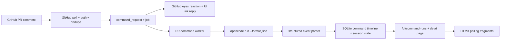

## Context

Heimdall already polls GitHub PR comments, persists command requests, and executes opencode-backed commands such as `/heimdall refine` through a background worker. The execution adapter already depends on `opencode run --format json` for machine-readable outcome classification, and the first structured event in that stream carries the canonical `sessionID` for the run.

What is missing is an operator-facing live view of that execution. Today, an accepted PR command can look silent until a terminal PR comment appears, and the private dashboard only shows tracked PR history rather than live opencode output. The requested behavior also needs GitHub-side acknowledgment as soon as Heimdall accepts the command, but the link in that acknowledgment cannot depend on `sessionID` because the session identity does not exist until after the worker starts consuming opencode output.

## Goals / Non-Goals

**Goals:**
- Add immediate visible GitHub acknowledgment when Heimdall accepts a supported PR command.
- Post a stable Heimdall UI link for accepted opencode-backed commands as soon as intake succeeds.
- Show currently active opencode-backed PR commands in the private dashboard.
- Render live opencode output in a human-readable form by parsing the structured JSON event stream.
- Capture the canonical `sessionID` from the first structured event and bind it to the same command-linked view.
- Keep the implementation inside the existing single Go binary, SQLite store, and HTMX-based operator UI.

**Non-Goals:**
- Introducing a SPA, WebSocket stack, or separate frontend deployment artifact.
- Exposing workflow-control buttons such as rerun, cancel, approve, or comment-posting from the UI.
- Rendering raw opencode JSON blobs, raw prompt bodies, or secrets directly in the dashboard.
- Mirroring every GitHub comment body or every provider payload into a new generic event archive.
- Changing the supported PR command surface or authorization model beyond acknowledgment and observability.

## Decisions

### Decision: Anchor GitHub live-output links on command request IDs, not session IDs
The GitHub reply comment should link to a stable command detail page such as `/ui/command-runs/{commandRequestID}`. That route exists as soon as Heimdall accepts and persists the command request, so the URL can be posted immediately during intake.

The detail page will resolve from existing `command_requests` and job state before opencode starts, and it will show queued or starting state until the worker creates and updates the live run timeline. Once the first structured event arrives, the same page will display the canonical `sessionID` and live output for the current run.

Rationale:
- `sessionID` is unavailable when Heimdall first acknowledges the command.
- retries and resumed runs are easier to reason about from the stable command-request identity.
- the same GitHub link remains valid before, during, and after execution.

Alternatives considered:
- Link by `sessionID`. Rejected because the ID arrives too late and cannot support immediate feedback.
- Link only to the PR detail page. Rejected because operators need a directly addressable run view from the GitHub reply comment.

### Decision: Persist a normalized command timeline in SQLite rather than exposing raw event streams
Heimdall will extend runtime state with additive command-run records and ordered timeline entries for opencode-backed PR commands. The model should remain command-centric and include at least the command-request linkage, attempt or continuity metadata, current state, canonical `sessionID` when known, timestamps, terminal summary, and ordered display entries.

The stored timeline entries should be UI-ready records such as assistant text blocks, tool-status rows, blocker notices, and terminal summaries rather than raw NDJSON lines. The dashboard will read only this normalized state and existing command/job metadata; it should not tail host logs or re-parse raw opencode output on page load.

Rationale:
- preserves live-output state across worker boundaries and page refreshes.
- keeps the dashboard independent of provider-specific raw JSON shapes.
- avoids making operators reconstruct runs from journald output.

Alternatives considered:
- Tail journald for live output. Rejected because logs are not a stable per-command UI contract.
- Store only raw JSON and transform it in the UI. Rejected because it leaks provider-specific payloads into the view layer and risks exposing sensitive content verbatim.

### Decision: Normalize opencode events into sanitized display entries at ingestion time
The opencode adapter should continue treating the NDJSON stream as the source of truth for session state, but it should now emit normalized display entries while it classifies the run. Text events become rendered output blocks, tool and step events become concise status lines, blocker events become highlighted notices, and terminal events become completion or failure summaries. Unknown but valid event types should fall back to a compact generic status entry instead of surfacing raw JSON.

The first structured event remains the canonical source of `sessionID`. Once captured, that same session identity is attached to the command-linked run state and shown in logs and the dashboard header.

Rationale:
- one parser pass drives both machine classification and human observability.
- UI rendering stays stable even if low-level event payloads are noisy or large.
- secrecy rules are easier to enforce before data reaches templates.

Alternatives considered:
- Parse raw JSON separately for outcome classification and UI rendering. Rejected because duplicate parsers increase drift risk.
- Expose only coarse status without timeline entries. Rejected because the user explicitly asked for live output visibility.

### Decision: Use HTMX polling fragments for live-tail list and detail views
The operator UI will remain server-rendered HTML. A new `/ui/command-runs` screen will show active queued, starting, running, or blocked opencode-backed commands, and a `/ui/command-runs/{commandRequestID}` detail page will show the selected command timeline.

HTMX will drive incremental refresh. The active-run list can refresh as a normal fragment on a short interval. The detail page should poll lightweight status and output fragments while the command is non-terminal, ideally by using a monotonic sequence cursor for timeline entries so the server does not have to resend the full history on every tick. The visible output should behave like a live tail: previously rendered lines stay in place while newly available entries are appended in stream order. Polling can stop or slow down after a terminal state is reached.

Rationale:
- matches the existing dashboard direction and the user's explicit HTMX request.
- keeps deployment simple and avoids a new push protocol.
- preserves a read-only HTML-first operator surface.

Alternatives considered:
- WebSockets or SSE. Rejected because they add more runtime complexity than v1 needs.
- Full-page refresh only. Rejected because live output would feel clumsy and delay observation.

### Decision: Separate intake acknowledgment from worker outcome reporting
Heimdall should publish acceptance feedback as part of command intake after the comment has been authorized, parsed, deduplicated as new, and persisted. All accepted supported PR commands get the GitHub `eyes` reaction. Accepted commands that start or resume opencode execution also get a PR reply comment with the stable command detail URL.

The worker continues to own terminal success, failure, or blocked result comments. Acknowledgment failures should be recorded and retried if needed, but they must not cause duplicate command execution or invalidate the accepted command request.

Rationale:
- users learn immediately that Heimdall saw the command.
- the PR feedback path becomes clearer without waiting for the worker to finish.
- keeps execution and GitHub feedback responsibilities explicit.

Alternatives considered:
- Wait until the worker starts before acknowledging. Rejected because queued commands would still appear silent.
- Replace terminal result comments with the live-output link comment. Rejected because the PR still needs a visible final outcome.

### Decision: Require a validated public operator URL for GitHub links
Heimdall will treat `HEIMDALL_SERVER_PUBLIC_URL` as the required absolute base URL for any dashboard link posted into GitHub comments. The service should validate that the value is present and absolute at startup so link comments are never built from relative paths or host-local guesses.

Rationale:
- GitHub comments need absolute URLs.
- startup validation is better than posting broken links at runtime.
- the repository already documents this setting in operations guidance.

Alternatives considered:
- Build links from the incoming request host header. Rejected because PR comments are posted outside any browser request context.
- Post relative paths. Rejected because GitHub comments cannot resolve them against the Heimdall server.

### Decision: Deduplicate accepted-command feedback at the command-request level
Heimdall will record whether the `eyes` reaction and the link comment have already been posted for a given command request. Retry or duplicate poll logic will check these flags before calling the GitHub API again.

Rationale:
- prevents duplicate reactions and link comments on retries or overlapping polls
- keeps the GitHub comment thread clean

Alternatives considered:
- Deduplicate by querying GitHub API before posting. Rejected because it adds API overhead and race conditions.

### Decision: Continue command execution even if acknowledgment fails
If the reaction or link comment step fails due to a transient GitHub API error, Heimdall will still enqueue the command for worker execution. A background reconciliation job can retry the missing acknowledgment later.

Rationale:
- avoids blocking real work because of a secondary feedback failure
- matches the existing reconciliation pattern for retrying failed comment status posts

Alternatives considered:
- Roll back the command acceptance if feedback fails. Rejected because it would create a poor user experience where valid commands are silently ignored.

### Decision: Define a bounded six-state command run model
The command-linked opencode run will have explicit states: `queued`, `starting`, `running`, `blocked`, `completed`, `failed`. The dashboard will render the current state label prominently, and the live tail will become active once the state reaches `running`.

Rationale:
- gives operators clear visibility into where the run is in its lifecycle
- distinguishes "accepted but not yet started" from "actively producing output"

Alternatives considered:
- Use only two states (active/terminal). Rejected because it hides useful pre-session and blocked states.

### Decision: Cap live-tail fragment size with a default limit
To prevent unbounded HTMX response growth, the dashboard will query the most recent N display entries (e.g., 200) for live-tail refreshes. A separate action will allow loading earlier history if needed.

Rationale:
- protects UI performance for very long runs
- keeps the default live-tail experience fast

Alternatives considered:
- Return all entries always. Rejected because very long runs could produce multi-megabyte HTML fragments.

### Decision: Maintain an explicit normalization mapping for opencode events
The opencode adapter will use a versioned mapping from known event types to display entry templates. New event types will fall back to a generic template rather than raw JSON.

Rationale:
- ensures consistent UI output across different commands and runs
- makes it easy to add richer rendering for new event types later

Alternatives considered:
- Ad-hoc normalization per event. Rejected because it leads to inconsistent UI output and harder testing.

## Risks / Trade-offs

- Private operator URLs become visible in PR comments to the PR's readers → Mitigation: keep the dashboard read-only, rely on the private/internal deployment boundary already assumed by Heimdall, and document the trust implication.
- Timeline storage can grow if long-running commands emit many display entries → Mitigation: store compact normalized entries, scope the feature to opencode-backed PR commands, and revisit retention separately if needed.
- HTMX polling is near-real-time rather than true push streaming → Mitigation: use short active polling intervals and cursor-based incremental fragments for detail output.
- Opencode may add new event types over time → Mitigation: keep adapter-level fallback rendering for unknown valid events so observability degrades gracefully instead of breaking.

## Migration Plan

1. Validate and plumb `HEIMDALL_SERVER_PUBLIC_URL` for dashboard link generation.
2. Add GitHub accepted-command acknowledgment flow: `eyes` reaction for accepted commands and reply-comment links for opencode-backed commands.
3. Extend runtime state and the opencode adapter to persist command-linked live timeline entries, current run status, and canonical `sessionID` from the first structured event.
4. Add dashboard routes, query services, templates, and HTMX fragments for active command runs and command detail pages.
5. Update behavior tests, step bindings, and operator docs for the new acknowledgment and live-output surfaces.

Rollback is low risk because the schema changes are additive. If the feature must be disabled, Heimdall can stop writing the new timeline records and stop serving the new dashboard routes while leaving additive tables unused until a later cleanup migration.

## Open Questions

None.
